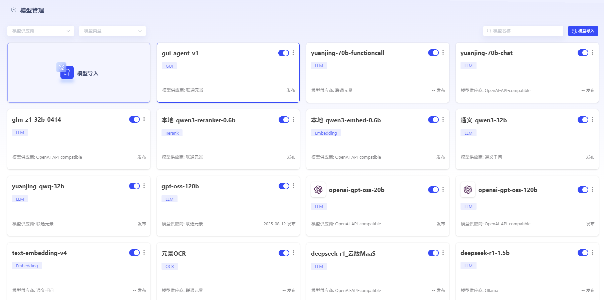
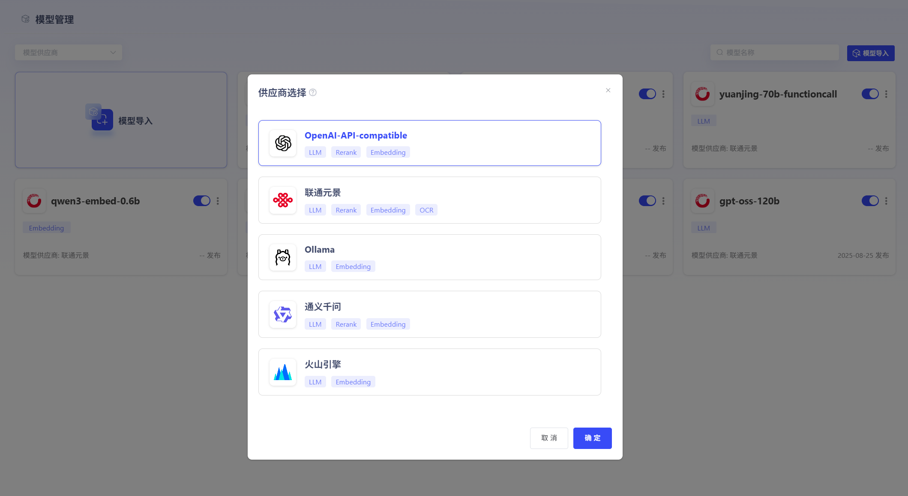

# 模型管理

用户可通过配置，在平台中接入外部模型。根据模型供应商规范，关联推理url。支持导入的模型包括LLM、Embedding、Rerank、OCR，开启服务后，可用于模型推理。具体导入方式，详见[模型导入方式-详细版](模型导入方式-详细版.md)






# API参考

## LLM

### OpenAI-API- compatible

**请求**

```bash
curl --location 'URL' \
--header 'Content-Type: application/json' \
--header 'Authorization: Bearer api-key' \
--data '{
    "messages": [
        {
            "role": "user",
            "content": "你是谁"
        }
    ],
    "model": "gpt-oss-20b",
    "stream": false
}'
```

**响应**

非流式响应

```bash
{
    "id": "chatcmpl-ec8ed5bef88849c4ab3147f650b3d3ec",
    "object": "chat.completion",
    "created": 1754964185,
    "model": "gpt-oss-20b",
    "choices": [
        {
            "index": 0,
            "message": {
                "role": "assistant",
                "content": "您好！  \n我是 ChatGPT，OpenAI 研发的人工智能语言模型，能够根据输入的文本进行对话、回答问题、提供建议、撰写文章等。您有什么想聊或者想了解的，尽管告诉我吧！",
                "tool_calls": []
            },
            "finish_reason": "stop"
        }
    ],
    "usage": {
        "prompt_tokens": 73,
        "completion_tokens": 179,
        "total_tokens": 252
    }
}
```

流式响应

```bash
{
    "id": "endpoint_common_250891",
    "object": "chat.completion.chunk",
    "created": 1754964492,
    "model": "deepseek-r1",
    "choices": [
        {
            "index": 0,
            "delta": {
                "role": "assistant",
                "content": "吗"
            },
            "finish_reason": null
        }
    ]
}
```


### 联通元景

**请求**

```bash
curl --location 'https://maas.ai-yuanjing.com/openapi/compatible-mode/v1/chat/completions' \
--header 'Content-Type: application/json' \
--header 'Authorization: Bearer api-key' \
--data '{
    "messages": [
        {
            "role": "user",
            "content": "你是谁"
        }
    ],
    "model": "deepseek-r1",
    "stream": false
}'
```

**响应**

非流式响应

```bash
{
    "id": "endpoint_common_249820",
    "object": "chat.completion",
    "created": 1754965561,
    "model": "deepseek-r1",
    "choices": [
        {
            "index": 0,
            "message": {
                "role": "assistant",
                "content": "<think>\n嗯，用户问了一个很基础但也很关键的问题：“你是谁”。这可能是第一次使用智能助手的用户，也可能是想确认当前对话对象身份的老用户。\n\n用户可能带着试探或好奇的心态提问，背后或许隐藏着“你能帮我做什么”“我该怎么和你交流”这样的潜在需求。考虑到问题非常简短，用户可能处于两种状态：要么是匆忙测试功能，要么是带着观察态度谨慎接触新事物。\n\n这种情况下，回复需要同时做到三点：明确身份建立信任感，展示功能激发兴趣，用表情符号传递友好态度。要避免过于技术化的术语，比如不说“我是基于Transformer架构的LLM”，而是用“智能助手”这样通俗的表达。\n\n用户没有提供任何背景信息，所以采用中性称呼“你”最安全。最后那句“现在有什么可以帮你的吗”是重要的话术转折，既开放又带引导性，能自然推动对话进入实用阶段。\n</think>\n你好呀！我是 **DeepSeek-R1**，一款由中国的「深度求索（DeepSeek）」公司研发的智能助手。你可以把我当作一个知识丰富、乐于助人的聊天伙伴 😊\n\n我的本领包括：\n\n- 📚 回答各种知识性问题（历史、科技、文学、生活常识等）  \n- ✍️ 帮你写文章、改简历、起标题、写文案  \n- 📊 处理和分析文档（Word、PDF、Excel等）  \n- 🧠 提供学习辅导、解题思路、论文润色  \n- 📅 安排计划、整理资料、做读书笔记  \n- 💬 陪你聊天谈心、解闷放松  \n\n我目前是**完全免费的**，也没有语音功能（纯文字交流），但我支持超长上下文记忆（128K tokens），上传文档也没问题哦！\n\n现在有什么可以帮你的吗？🌟",
                "tool_calls": null
            },
            "finish_reason": "stop"
        }
    ],
    "usage": {
        "prompt_tokens": 6,
        "completion_tokens": 378,
        "total_tokens": 384
    }
}
```

流式响应

```bash
{
    "id": "endpoint_common_250934",
    "object": "chat.completion.chunk",
    "created": 1754965671,
    "model": "deepseek-r1",
    "choices": [
        {
            "index": 0,
            "delta": {
                "role": "assistant",
                "content": "🌟"
            },
            "finish_reason": null
        }
    ]
}
```


### Ollama

**请求**

```bash
curl --location 'http://ip:11434/v1/chat/completions' \
--header 'Content-Type: application/json' \
--data '{
    "model": "deepseek-r1:1.5b",
    "messages": [
        {
            "role": "user",
            "content": "你是谁"
        }
    ]
}'
```

**响应**

非流式响应

```bash
{
    "id": "chatcmpl-403",
    "object": "chat.completion",
    "created": 1754965819,
    "model": "deepseek-r1:1.5b",
    "system_fingerprint": "fp_ollama",
    "choices": [
        {
            "index": 0,
            "message": {
                "role": "assistant",
                "content": "<think>\n\n</think>\n\n您好！我是由中国的深度求索（DeepSeek）公司开发的智能助手DeepSeek-R1。如您有任何任何问题，我会尽我所能为您提供帮助。"
            },
            "finish_reason": "stop"
        }
    ],
    "usage": {
        "prompt_tokens": 5,
        "completion_tokens": 40,
        "total_tokens": 45
    }
}
```

流式响应

```bash
{
    "id": "chatcmpl-323",
    "object": "chat.completion.chunk",
    "created": 1754965959,
    "model": "deepseek-r1:1.5b",
    "system_fingerprint": "fp_ollama",
    "choices": [
        {
            "index": 0,
            "delta": {
                "role": "assistant",
                "content": "。"
            },
            "finish_reason": null
        }
    ]
}
```

### 通义千问

**请求**

```bash
curl --location 'https://dashscope.aliyuncs.com/compatible-mode/v1/chat/completions' \
--header 'Authorization: Bearer api-key' \
--header 'Content-Type: application/json' \
--data '{
    "model": "qwen-flash",
    "messages": [
        {
            "role": "user",
            "content": "你好"
        }
    ],
    "stream": false,
    "enable_thinking":true 
}'
```

**响应**

非流式响应

```bash
{
    "choices": [
        {
            "message": {
                "content": "你好！😊 有什么我可以帮你的吗？",
                "reasoning_content": "嗯，用户发来“你好”，这是一个常见的打招呼方式。我需要友好地回应。首先，确认用户可能需要帮助，所以应该用中文回复，保持礼貌。\n\n接下来，考虑用户可能的意图。他们可能刚接触这个平台，或者有具体的问题需要解决。作为AI，我应该提供帮助，同时保持简洁。\n\n检查之前的对话历史，但这里没有上下文，所以需要从头开始。确保回复不带任何假设，避免复杂信息。\n\n可能需要询问用户需要什么帮助，这样能引导他们进一步说明需求。例如，“你好！有什么我可以帮你的吗？”\n\n还要注意语气，用表情符号可能让回复更亲切，但不确定用户偏好，所以可能保持中性。不过根据之前的例子，有时候用😊可以增加友好感。\n\n避免使用专业术语，保持口语化。比如不要说“请问您需要什么帮助？”，而是更自然的“你好！有什么我可以帮你的吗？”\n\n检查有没有拼写错误，确保回复正确。中文的“你好”是正确的。\n\n可能需要考虑用户是否是第一次使用，所以回复要友好且开放，鼓励他们提出问题。\n\n最后，确保回复简短，不要冗长，这样用户不会感到压力。\n\n所以，综合起来，回复应该是：“你好！😊 有什么我可以帮你的吗？” 这样既友好又明确。",
                "role": "assistant"
            },
            "finish_reason": "stop",
            "index": 0,
            "logprobs": null
        }
    ],
    "object": "chat.completion",
    "usage": {
        "prompt_tokens": 9,
        "completion_tokens": 292,
        "total_tokens": 301
    },
    "created": 1754966125,
    "system_fingerprint": null,
    "model": "qwen-flash",
    "id": "chatcmpl-ae34fd13-c4c1-987d-bc20-09fe6f6d4936"
}
```

流式响应

```bash
{
    "choices": [
        {
            "delta": {
                "content": " 有什么我可以帮助",
                "reasoning_content": null
            },
            "finish_reason": null,
            "index": 0,
            "logprobs": null
        }
    ],
    "object": "chat.completion.chunk",
    "usage": null,
    "created": 1754966192,
    "system_fingerprint": null,
    "model": "qwen-flash",
    "id": "chatcmpl-7143c7c5-2128-9a6a-b8dc-18c2c306bc14"
}
```

### 火山引擎

**请求**

```bash
curl --location 'https://ark.cn-beijing.volces.com/api/v3/chat/completions' \
--header 'Content-Type: application/json' \
--header 'Authorization: Bearer api-key' \
--data '{
  "do_sample": false,
  "messages": [
    {
      "content": "你好",
      "role": "user"
    }
  ],
  "model": "doubao-seed-1-6-flash-250715",
  "repetition_penalty": 1.1,
  "stream": true,
  "temperature": 0.01
}'
```

**响应**

非流式响应（目前思维链尚未兼容 reasoning_content)

```bash
{
    "choices": [
        {
            "finish_reason": "stop",
            "index": 0,
            "logprobs": null,
            "message": {
                "content": "你好呀！很高兴见到你~ 有什么我可以帮你的吗？😊",
                "reasoning_content": "\n用户现在说“你好”，我需要友好地回应。首先，保持礼貌和热情，直接回应用户的问候，然后可以稍微引导一下，问问用户有什么需要帮助的，这样能让对话继续下去。比如可以说“你好呀！很高兴见到你~ 有什么我可以帮你的吗？😊” 这样既回应了问候，又表达了愿意提供帮助的态度，还带了个表情符号显得更亲切。",
                "role": "assistant"
            }
        }
    ],
    "created": 1754966401,
    "id": "021754966399956ef34c300eb7cd27671b96789a585234f4250fd",
    "model": "doubao-seed-1-6-flash-250715",
    "service_tier": "default",
    "object": "chat.completion",
    "usage": {
        "completion_tokens": 119,
        "prompt_tokens": 85,
        "total_tokens": 204,
        "prompt_tokens_details": {
            "cached_tokens": 0
        },
        "completion_tokens_details": {
            "reasoning_tokens": 101
        }
    }
}
```

流式响应

```bash
{
    "choices": [
        {
            "delta": {
                "content": "😊",
                "role": "assistant"
            },
            "index": 0
        }
    ],
    "created": 1754966363,
    "id": "021754966363144ef34c300eb7cd27671b96789a585234fa38263",
    "model": "doubao-seed-1-6-flash-250715",
    "service_tier": "default",
    "object": "chat.completion.chunk",
    "usage": null
}
```


## Rerank

### OpenAI-API- compatible

**请求**

```bash
curl --location 'URL' \
--header 'Authorization: Bearer api-key' \
--header 'Content-Type: application/json' \
--data '{
    "model": "模型id",
    "query": "Apple",
    "documents": [
        "你好啊，世界",
        "我爱吃汉堡",
        "尖尖我噶奶",
        "乌萨奇",
        "雷欧奥特曼"
    ],
    "top_n": 2,
    "return_documents": true
}'
```

**响应**

```bash
{
    "model": "jina-reranker-v2-base-multilingual",
    "usage": {
        "total_tokens": 42
    },
    "results": [
        {
            "index": 3,
            "document": {
                "text": "乌萨奇"
            },
            "relevance_score": 0.9674102663993835
        },
        {
            "index": 0,
            "document": {
                "text": "你好啊，世界"
            },
            "relevance_score": 0.16132023930549622
        },
        {
            "index": 1,
            "document": {
                "text": "我爱吃汉堡"
            },
            "relevance_score": 0.06853749603033066
        }
    ]
}
```

### 联通元景

**请求**

```bash
curl --location 'https://maas-api.ai-yuanjing.com/openapi/bge/v1/rerank' \
--header 'Content-Type: application/json' \
--header 'Authorization: Bearer api-key' \
--data '{
    "query": "今天天气不错",
    "texts": [
        "天气很好",
        "股票涨跌跟天气无关",
        "今天北京雾霾严重"
    ]
}'
```

**响应**

```bash
[
    {
        "index": 0,
        "score": 4.88899040222168,
        "document": "天气很好"
    },
    {
        "index": 1,
        "score": -4.119245529174805,
        "document": "股票涨跌跟天气无关"
    },
    {
        "index": 2,
        "score": -6.025328159332275,
        "document": "今天北京雾霾严重"
    }
]
```

### 通义千问

**请求**

```bash
curl --location 'https://dashscope.aliyuncs.com/api/v1/services/rerank/text-rerank/text-rerank' \
--header 'Authorization: Bearer api-key' \
--header 'Content-Type: application/json' \
--data '{
    "model": "gte-rerank",
    "input":{
         "query": "什么是文本排序模型",
         "documents": [
         "文本排序模型广泛用于搜索引擎和推荐系统中，它们根据文本相关性对候选文本进行排序",
         "量子计算是计算科学的一个前沿领域",
         "预训练语言模型的发展给文本排序模型带来了新的进展"
         ]
    },
    "parameters": {
        "return_documents": true,
        "top_n": 3
    }
}'
```

**响应**

```bash
{
    "output": {
        "results": [
            {
                "document": {
                    "text": "文本排序模型广泛用于搜索引擎和推荐系统中，它们根据文本相关性对候选文本进行排序"
                },
                "index": 0,
                "relevance_score": 0.7315062086803763
            },
            {
                "document": {
                    "text": "预训练语言模型的发展给文本排序模型带来了新的进展"
                },
                "index": 2,
                "relevance_score": 0.5831720487049298
            },
            {
                "document": {
                    "text": "量子计算是计算科学的一个前沿领域"
                },
                "index": 1,
                "relevance_score": 0.04973238644524712
            }
        ]
    },
    "usage": {
        "total_tokens": 79
    },
    "request_id": "8baa31dc-a786-9326-8e20-895c74bbff16"
}
```

## Embedding

### OpenAI-API- compatible

**请求**

```bash
curl --location 'URL' \
--header 'Authorization: Bearer api-key' \
--header 'Content-Type: application/json' \
--data '{
    "model": "BAAI/bge-large-zh-v1.5",
    "input": [
        "风急天高猿啸哀",
        "渚清沙白鸟飞回"
    ],
    "encoding_format": "float"
}'
```

**响应**

```bash
{
    "object": "list",
    "data": [
        {
            "embedding": [
                0.018213777,
                -0.026578045,
                0.018492958,
                -0.01139059,
                0.04650041,
                0.021854298,
                -0.056059573,
                -0.034439784,
                0.043842606,
                ……
            ],
            "index": 1,
            "object": "embedding"
        }
    ],
    "model": "BAAI/bge-large-zh-v1.5",
    "usage": {
        "prompt_tokens": 18,
        "completion_tokens": 0,
        "total_tokens": 18
    }
}
```

### 联通元景

**请求**

```bash
curl --location 'https://maas-api.ai-yuanjing.com/openapi/compatible-mode/v1/embeddings' \
--header 'Content-Type: application/json' \
--header 'Authorization: Bearer api-key' \
--data '{
    "model": "qwen3-embed-0.6b",
    "input": [
        " 你好"
    ],
    "encoding_format": "float"
}'
```

**响应**

```bash
{
    "id": "embd-15c7e7b5-eccf-9140-afe2-42e25e88fd6d",
    "object": "list",
    "created": 1754967486,
    "model": "qwen3-embed-0.6b",
    "data": [
        {
            "object": "embedding",
            "embedding": [
                0.013916015625,
                0.0147705078125,
                0.06689453125,
                ……
            ],
            "index": 0
        }
    ],
    "usage": {
        "prompt_tokens": 3,
        "completion_tokens": 0,
        "total_tokens": 3
    }
}
```

### Ollama

**请求**

```bash
curl --location 'http://ip:11434/v1/embeddings' \
--header 'Content-Type: application/json' \
--data '{
    "encoding_format": "float",
    "input": [
        " 你好"
    ],
    "model": "granite-embedding:latest"
}'
```

**响应**

```bash
{
    "object": "list",
    "data": [
        {
            "object": "embedding",
            "embedding": [
                0.011519907,
                -0.14500324,
                0.092740096,
                ……
            ],
            "index": 0
        }
    ],
    "model": "granite-embedding:latest",
    "usage": {
        "prompt_tokens": 5,
        "total_tokens": 5
    }
}
```

### 通义千问

**请求**

```bash
curl --location 'https://dashscope.aliyuncs.com/compatible-mode/v1/embeddings' \
--header 'Authorization: Bearer api-key' \
--header 'Content-Type: application/json' \
--data '{
  "encoding_format": "float",
  "input": [
    "你好"
  ],
  "model": "text-embedding-v4"

}'
```

**响应**

```bash
{
    "data": [
        {
            "embedding": [
                0.00904093962162733,
                0.040408216416835785,
                -0.025859294459223747,
                0.03675258532166481,
                0.04067809507250786,
                ……
            ],
            "index": 0,
            "object": "embedding"
        }
    ],
    "object": "list",
    "model": "text-embedding-v4",
    "usage": {
        "prompt_tokens": 2,
        "total_tokens": 2
    },
    "id": "21fe5ad3-c5b7-9ba4-bad2-9d926691b4f3"
}
```

## OCR

### 联通元景

**请求**

```bash
curl --location 'https://maas-api.ai-yuanjing.com/openapi/v1/unicom-ocr' \
--header 'Content-Type: multipart/form-data' \
--header 'Authorization: Bearer api-key' \
--form 'file=上传文件'
```

**响应**

```bash
{
    "id": "embd-15c7e7b5-eccf-9140-afe2-42e25e88fd6d",
    "object": "list",
    "created": 1754967486,
    "model": "qwen3-embed-0.6b",
    "data": [
        {
            "object": "embedding",
            "embedding": [
                0.013916015625,
                0.0147705078125,
                0.06689453125,
                ……
            ],
            "index": 0
        }
    ],
    "usage": {
        "prompt_tokens": 3,
        "completion_tokens": 0,
        "total_tokens": 3
    }
}
```
