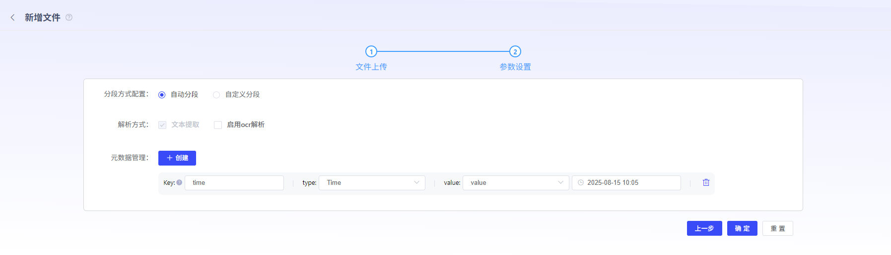

# 创建知识库

若用户要使用RAG功能，需要先创建知识库，关联Embedding模型。其中Embedding模型，需提前在模型管理模块上传。用户也可进行标签设置，方便进行知识库筛选分类。（已创建但未填写内容的标签，可通过Backspace键快捷删除）

**创建知识库**：

**1）文件上传：**平台支持用户上传本地文件或者从url上传。

**2）参数配置：**平台支持自动分段与自定义分段2种模式。

- **自定义分段**
  - **分段标识：**分隔符是用于分隔文本的字符。\n\n和 \n 是常用于分隔段落和行的分隔符。用逗号连接分隔符(\n\n,\n)当段落超过最大块长度时，会按行进行分割。您也可以使用自定义的特殊分隔符或我们提供的标点符号分割。
  - **可分割最大值：**分段内容最大长度，单位为tokens
  - **可重叠值：**设置分段之间的重叠长度可以保留分段之间的语义关系，提升召回效果。是可分割最大值的百分比。
  - **文本预处理规则：**替换掉连续的空格、换行符和制表符；删除所有 URL 和电子邮件地址

**3）文件解析方式：**文本提取、OCR解析（需提前在模型管理中接入ocr模型）

**4）元数据管理：**元数据是描述文档关键信息的“数据标签”。它不包含文档的具体内容，而是用来定义文档的属性，帮助您对文档进行结构化管理。

- **Key：**元数据字段是构成文档元数据的基本单元，它们为文档信息提供了标准化的分类和存储方式。通过定义和使用不同的字段，我们可以系统化地捕捉和管理文档的关键信息。

- **类型：**
  - **字符串**（String）：文本值。
  - **数字**（Number）：数值。
  - **时间**（Time）：日期和时间。
  
- **Value：**该字段的具体信息或属性
  - value：填写具体的值
  - regExp：填写正则表达式
  
  

**文档处理状态**：

 1）处理状态：上传完毕的文档可在文档列表中查看。文档内容的解析切分状态可在当前状态列中查看。当状态为“处理完成”，该文档知识即可在后续RAG使用知识库中生效。

2）查看分段结果：点击操作列的“查看”，即可查看状态为处理完成的文档分段结果。

在分段结果查看中，可以查看文档分段策略，及每一个分段的内容结果。可根据用户需求，点击每个分段卡片上的启停开关，对单独分段进行启动和停止。也可点击一键全启动或一键全停用，对整个文档的分段结果进行启动和停止。 

注：停止的分段内容在使用RAG能力时不会生效。 如需查看切段完整信息，点击分段卡片，可展示该分段的详情。

**3）元数据编辑**

平台可自动根据文档内容匹配出元数据标签。元数据用于描述文档的属性，可以帮助您更好地组织和管理文档。用户可对识别出来的元数据value进行编辑、新增或删除。

