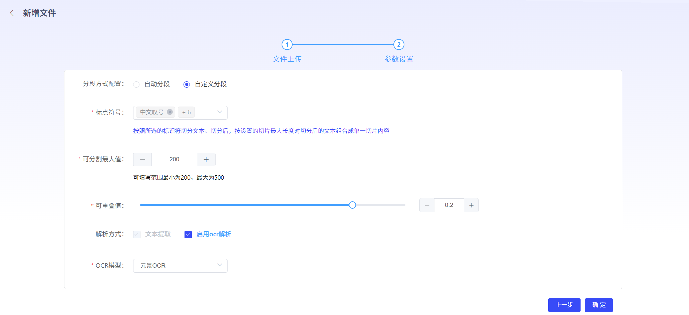
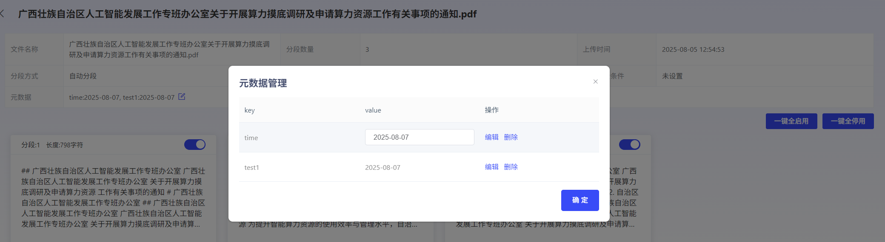

# 创建知识库

若用户要使用RAG功能，需要先创建知识库，关联Embedding模型。其中Embedding模型，需提前在模型管理模块上传。用户也可进行标签设置，方便进行知识库筛选分类。（已创建但未填写内容的标签，可通过Backspace键快捷删除）

**创建知识库**：

1）文件上传：平台支持用户上传本地文件或者从url上传。

2）参数配置：平台支持自动分段与自定义分段2种模式。自定义分段，用户可设置分段时的标点符号、可分割最大值、可重叠值。若在模型广场中接入了ocr模型，解析方式还可勾选OCR，并选择对应模型。

**文档处理状态**：

 1）处理状态：上传完毕的文档可在文档列表中查看。文档内容的解析切分状态可在当前状态列中查看。当状态为“处理完成”，该文档知识即可在后续RAG使用知识库中生效。

2）查看分段结果：点击操作列的“查看”，即可查看状态为处理完成的文档分段结果。

在分段结果查看中，可以查看文档分段策略，及每一个分段的内容结果。可根据用户需求，点击每个分段卡片上的启停开关，对单独分段进行启动和停止。也可点击一键全启动或一键全停用，对整个文档的分段结果进行启动和停止。 

注：停止的分段内容在使用RAG能力时不会生效。 如需查看切段完整信息，点击分段卡片，可展示该分段的详情。

**3）元数据编辑**

平台可自动根据文档内容匹配出元数据标签。元数据用于描述文档的属性，可以帮助您更好地组织和管理文档。用户可对识别出来的元数据value进行编辑。

