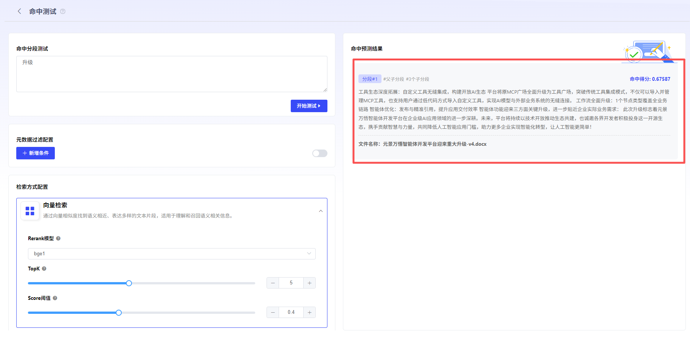
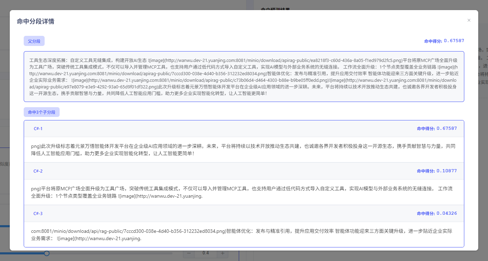

# 创建命中测试

当用户需要测试知识库是否生效时，可使用“命中测试”功能快速测试。 点击“命中测试”按钮，进入命中测试界面。在“命中测试分段”中输入关键词并配置[检索方式](检索方式配置.md)、[元数据过滤](元数据过滤.md)。如命中结果，即可获得相关命中得分，及分段内容，确认该知识分段已生效。

- **通用分段**

  在通用分段模式下，命中预测结果会显示命中的分段内容与命中得分。得分越高，说明问题关键词与内容块的的匹配度越高。

- **父子分段**

  在父子分段模式下，命中预测结果会显示命中的分段内容与命中得分。区块右上角的得分指的是子区块与关键词之间的匹配得分。得分越高，说明问题关键词与内容块的的匹配度越高。点击分段内容，可查看详情。

  