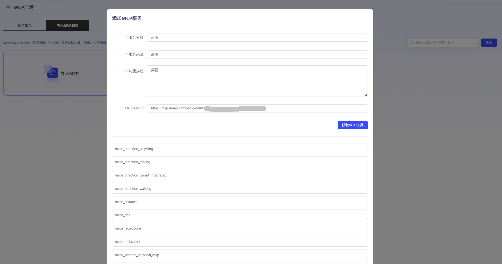
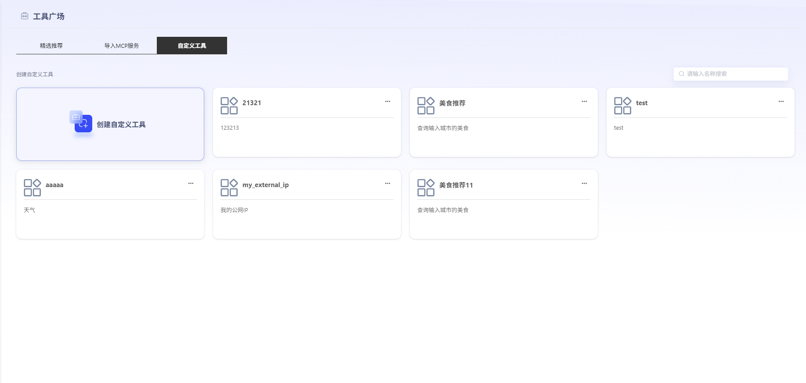
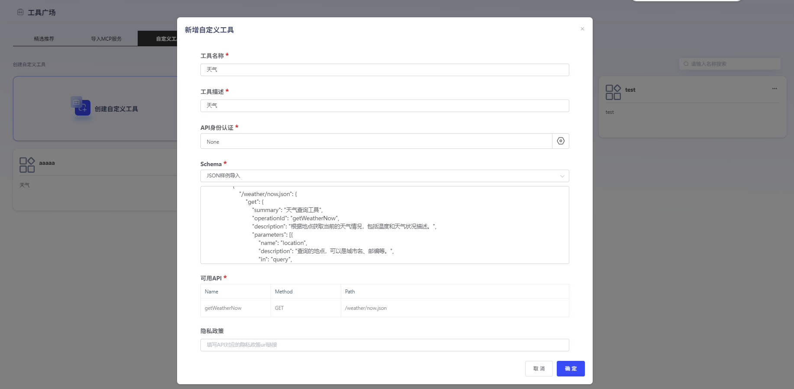

# 工具广场

工具广场集合纳管MCP server、自定义工具，并提供精选推荐供用户选择，即选即用。

### 1、精选推荐

平台提供优选MCP server，用户点击“导入MCP服务”，在编辑界面将url替换为自己的链接后使用。从精选推荐导入的MCP server，可在“导入MCP服务”模块统一查看。

### 2、导入MCP服务

点击“导入”，关联自己的MCP，可支持在工作流中使用。用户需填写服务名称、服务来源、功能描述、MCP ServerURL。点击“获取MCP工具”，获取成功后，将显示可用接口。点击“确认发布”，即可在平台上查看每个工具的详细内容。

### 3、导入自定义工具

点击“导入”，可链接第三方开源API接口，后续可在智能体中进行工具关联。选择接口样例或自行输入Schema后，即可获得api参数。

