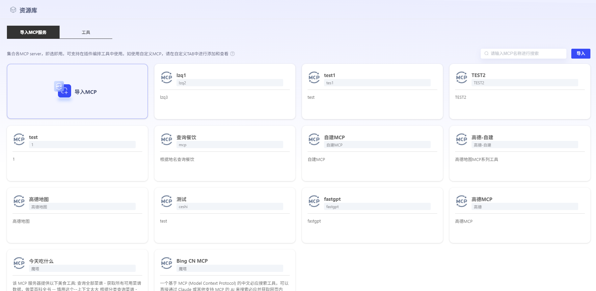
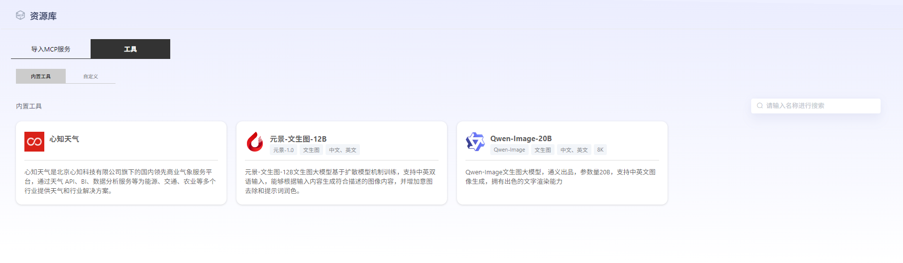
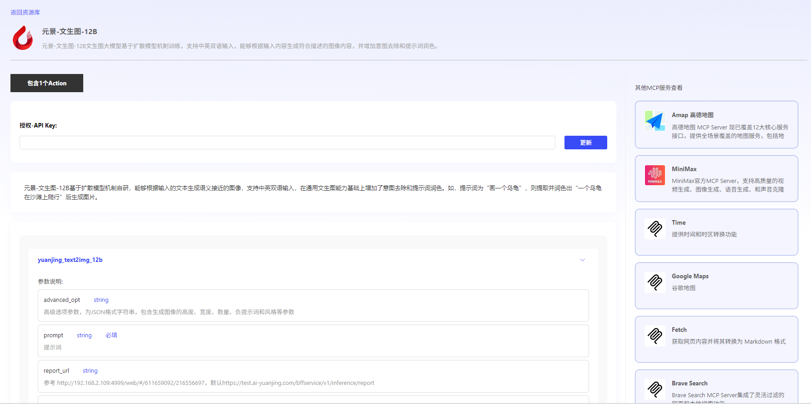
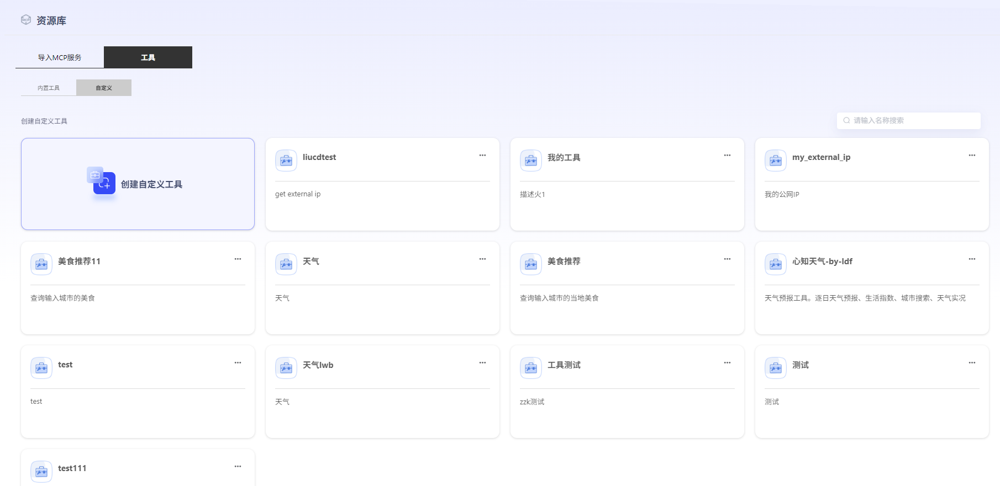

# 资源库

资源库集合纳管MCP服务和工具，即选即用。

### MCP服务

点击“导入”，关联自己的MCP，可支持在工作流中使用。用户需填写服务名称、服务来源、功能描述、MCP ServerURL。点击“获取MCP工具”，获取成功后，将显示可用接口。点击“确认发布”，即可在平台上查看每个工具的详细内容。

### 工具

工具分为内置工具和自定义工具。

- **内置工具**

​	平台内置多款工具，用户可通过配置API Key直接使用。点击内置工具可查看相关介绍以及参数解析。

- **自定义工具**

点击“创建自定义工具”，可链接第三方开源API接口，后续可在智能体中进行工具关联。选择接口样例或自行输入Schema后，即可获得api参数。

