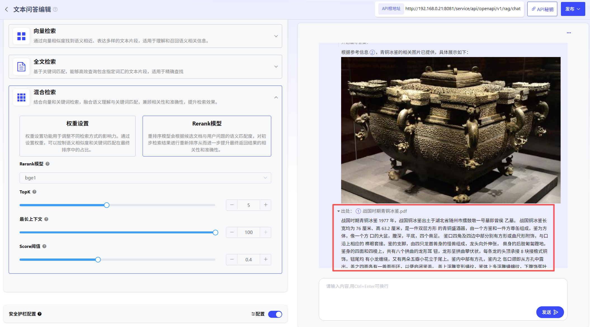

# 文本问答

### 1、文本问答创建

点击“创建文本问答”即可创建文本问答应用。用户可自行设定文本问答图标、名称、描述。

### 2、文本问答编辑

可通过选择大模型、知识库、配置检索方式，进行文本问答。问答将局限于知识库内，并给出相应出处。

目前支持3种检索方式配置，用户可根据知识库内文档的内容特点及使用场景，调整检索策略：

1、向量检索：通过向量相似度找到语义相近、表达多样的文本片段，适用于理解和召回语义相关信息。

2、全文检索基于关键词匹配，能够高效查询包含指定词汇的文本片段，适用于精确查找。

3、混合检索：结合向量和关键词检索，融合语义理解与关键词匹配，兼顾相关性和准确性，提升检索效果。

### 3、文本问答发布

编辑完毕的文本问答应用，点击“发布”可进行发布方式选择，用户可进行私密发布，也可进行公开发布。

私密发布：发布后仅对自己可见，可在“探索广场”-“私密发布的”查看。

公开发布：发布后可对全部用户进行共享，所有用户可在“探索广场”-“全部”查看。

已发布的文本问答也可取消发布后，重新进行编辑。

### 4、生成API

  平台已针对应用封装了API，可点击“API秘钥”生成应用的专属API-Key授权，供用户进行调用。

