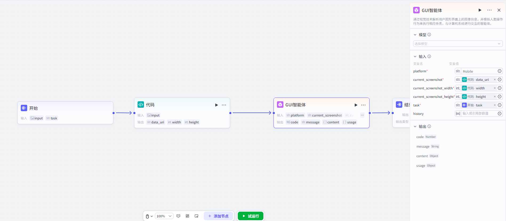
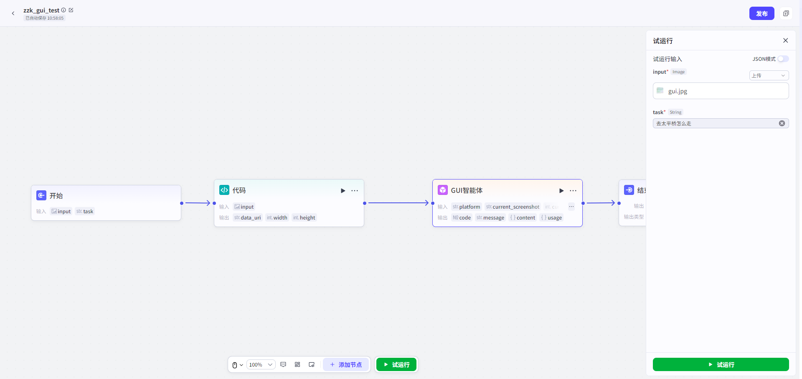
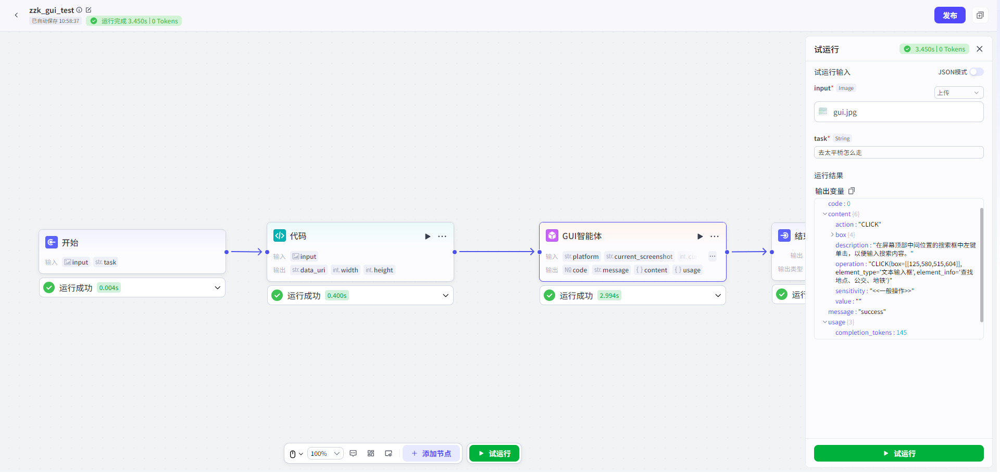

# GUI智能体

## 节点概述
**核心功能**：通过视觉技术解析用户图形界面上的图像信息，并模拟人类操作行为来执行相应任务，与计算机系统进行交互的智能体。

## 配置指南

配置变量聚合节点主要分为三个步骤：**选择模型 -> 配置输入 -> 输出变量**。
##### 选择模型
用户需从模型管理-联通元景供应商中，添加GUI模型。

##### 配置输入

* platform：平台信息，移动端填写`Mobile`, Windows端填写`WIN`，Mac端填写`MAC`。
* current_screenshot：当前屏幕截图，Base64编码的图像字符串。
* current_screenshot_width：当前屏幕截图的宽度。
* current_screenshot_height：当前屏幕截图的高度。
* task：当前用户任务。
* history：当前任务的历史返回结果，历次返回结果中的content字段。

##### 输出变量

* code：状态码
* message：提示信息
* content：回答文本
  * -description `String`：预测操作的描述
  * -operation  `String`：预测的操作
  * -action  `String`：操作类型，详见备注：支持的操作类型
  * -box `list[int]`：操作的位置的左上角和右下角的坐标，[xmin,ymin,xmax,ymax]
  * -value  `String`：操作内容，当操作类型为TYPE、LAUNCH时使用
  * -sensitivity  `String`：操作敏感性字段，分为一般操作、敏感操作和危险操作三类
* usage：Token计数
  * -prompt_tokens `int`：Prompt的token数
  * -completion_tokens `int`：生成结果的token数
  * -total_tokens `int`：总token数

