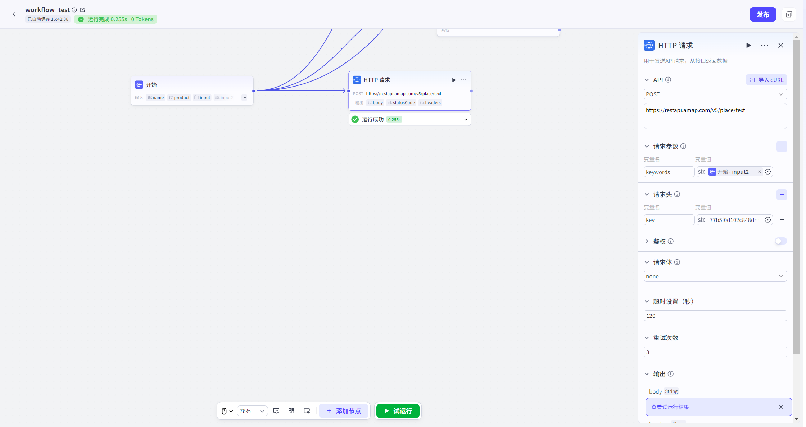

# HTTP请求

## 节点概述
核心功能：能够与任何基于HTTP协议的服务进行对话、交换数据。

## 配置指南

##### 1. 请求方法

定义您希望对目标资源执行的操作类型。

| 方法       | 描述                                                         | 典型应用场景                                         |
| :--------- | :----------------------------------------------------------- | :--------------------------------------------------- |
| **GET**    | 从服务器获取指定资源。                                       | 查询用户信息、获取天气数据、读取文章列表。           |
| **POST**   | 向服务器提交数据，以创建新资源。                             | 提交表单、上传新文件、创建新订单。                   |
| **PUT**    | 向服务器上传完整资源，用于**全量更新**已存在资源或**创建**资源（如果不存在）。 | 更新用户全部资料、替换整个文件内容。                 |
| **PATCH**  | 对资源进行**部分修改**。                                     | 仅更新用户的昵称、修改文章的标题。                   |
| **DELETE** | 请求服务器删除指定的资源。                                   | 删除用户、移除订单、清理文件。                       |
| **HEAD**   | 与 GET 类似，但服务器**仅返回响应头**，不返回资源主体。      | 检查资源是否存在、获取资源的元数据（如大小、类型）。 |

> **提示**：在配置请求 URL 时，您可以通过输入 `{{` 来唤出并使用工作流中的变量，实现动态参数化。

##### 2. 请求地址

目标 API 的完整 URL。例如：`https://api.example.com/v1/users/{{user_id}}`。

##### 3. 请求参数

附加在 URL 末尾的键值对（Query String），用于向服务器传递过滤、排序或分页等额外信息。

*   **示例**：在 URL `https://api.example.com/search?keyword=workflow&page=1` 中，`keyword=workflow` 和 `page=1` 即为请求参数。

##### 4. 请求头

包含请求的元数据，用于向服务器传递关于客户端、请求内容或期望响应格式的附加信息。

*   **常见示例**：
    *   `Content-Type`: 声明请求体的数据格式（如 `application/json`）。
    *   `Accept`: 告知服务器客户端希望接收的响应格式（如 `application/json`）。
    *   `User-Agent`: 标识客户端的应用类型、操作系统和软件版本。

##### 5. 鉴权

为确保请求安全，防止未授权访问，本节点支持多种鉴权方式。

*   **Bearer Token**：
    *   **说明**：一种常用的令牌认证方式，常用于 OAuth 2.0 协议。
    *   **配置**：输入您的 Token 值。系统会自动将其添加到请求头的 `Authorization` 字段中，格式为 `Authorization: Bearer <您的Token>`。
*   **自定义鉴权**：
    *   **说明**：提供更灵活的认证配置，以满足不同 API 的自定义需求。
    *   **配置**：
        *   **Key**: 认证的键名（如 `X-API-KEY`）。
        *   **Value**: 认证的键值。
        *   **Add To**: 选择认证信息的添加位置。
            *   **Header**: 添加到请求头（推荐）。
            *   **Query**: 添加到 URL 查询参数中。

##### 6. 请求体

- 仅在 `POST`, `PUT`, `PATCH` 等方法中有效，包含要发送给服务器的数据。您可以根据 API 要求选择合适的格式：

  *   **JSON**: 发送结构化的 JSON 数据，最常用的 RESTful API 格式。

  *   **form-data**: 用于上传文件，或发送包含二进制数据的复杂表单。

  *   **x-www-form-urlencoded**: 用于发送简单的键值对表单数据。

  *   **raw (Text/XML/HTML)**: 发送纯文本、XML 或 HTML 等原始格式数据。

##### 7. 超时设置

- 设置请求的最大等待时间。若服务器在指定时间内未响应，请求将被判定为失败，以避免长时间阻塞工作流。

##### 8. 重试次数

- 设置请求失败后的自动重试次数。通过自动重试机制，可以有效应对网络抖动或服务器临时故障，提高请求的最终成功率。

**9.输出**

- 输出变量包括响应体、状态码和响应头。

**10.异常忽略**

- 支持**异常忽略**功能。开启此功能后，如果试运行工作流时此节点运行失败，工作流不会中断，而是继续运行后续下游节点。如果下游节点引用了此节点的输出内容，则使用此节点预先配置的默认输出内容。

## 典型应用场景

HTTP请求节点是工作流实现外部交互的**万能钥匙**，常见于以下四大类场景：

| 场景类别     | 描述                                                    | 典型案例                                                |
| :----------- | :------------------------------------------------------ | :------------------------------------------------------ |
| **数据获取** | 从外部API拉取信息，为工作流提供决策依据或丰富回复内容。 | 查询实时天气、获取用户在CRM中的资料、抓取最新新闻头条。 |
| **数据提交** | 将工作流中产生的数据，发送到外部系统进行存储或处理。    | 将用户反馈提交到内部工单系统、将表单数据写入数据库。    |
| **数据更新** | 修改外部系统中已存在的数据，实现双向同步。              | 在CRM中更新客户的联系方式、修改订单的配送地址。         |
| **数据删除** | 根据业务逻辑，请求外部系统删除指定数据。                | 删除一个过期的优惠券、注销一个测试账户。                |

