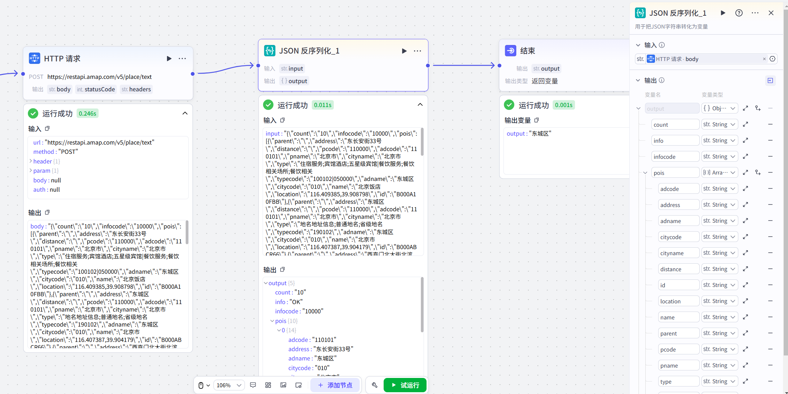

# JSON反序列化

## 节点概述
核心功能：将一个标准化的JSON字符串，拆解还原成结构化的数据对象，并让你能像使用普通变量一样，轻松调用其中的每一个字段。


## 配置指南

##### 1、添加节点

在工作流画布中，点击 **+ 添加节点**，在组件区域搜索并选择 **JSON反序列化节点**，即可将其添加到画布中。

##### 2、 配置节点

**输入**

*   **引用上游变量（最常用）：** 点击输入框，在弹出的变量列表中选择上游节点的输出变量。例如，上游节点（如HTTP节点）的输出变量 body 通常就是一个字符串类型的JSON数据，因此可以直接作为本节点的输入。
*   **直接输入内容：** 你也可以直接输入一个符合JSON格式的字符串，String格式的文本。


**输出**

- **配置项：** output (固定参数)

- **数据类型：** 默认为 Object (对象)，也可根据需要指定为 String、Integer 等其他基础类型。

-  **配置子项**

  - **方式一：手动配置（精准控制）**

    - 如果你只需要JSON中的部分字段，可以手动添加。例如，API返回了店名、地址、城市、邮编等，但你只需要将店名和地址存入数据库。那么，你只需为 output 配置 name 和 address 两个子项即可。这样做的好处是输出更干净，避免无用数据的传递。

  -  **方式二：导入示例（智能快捷）**

    -  当JSON结构复杂、字段繁多时，手动配置会很麻烦。此时，你可以点击导入示例”，将一段典型的JSON数据粘贴进去。系统会自动解析其结构，并将所有字段一键配置为 output 的子项。这极大地提升了配置效率和准确性。

      **示例：**

      ```
      {
          "count": "10",
          "info": "OK",
          "infocode": "10000",
          "pois": [
            {
              "adcode": "110101",
              "address": "东长安街33号",
              "adname": "东城区",
              "citycode": "010",
              "cityname": "北京市",
              "distance": "",
              "id": "B000A10FBB",
              "location": "116.409385,39.908798",
              "name": "北京饭店",
              "parent": "",
              "pcode": "110000",
              "pname": "北京市",
              "type": "住宿服务;宾馆酒店;五星级宾馆|餐饮服务;餐饮相关场所;餐饮相关",
              "typecode": "100102|050000"
            }
          ],
          "status": "1"
      }
      ```



