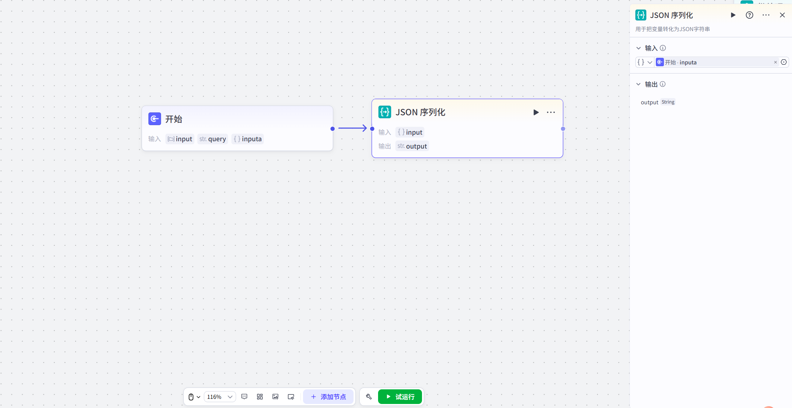
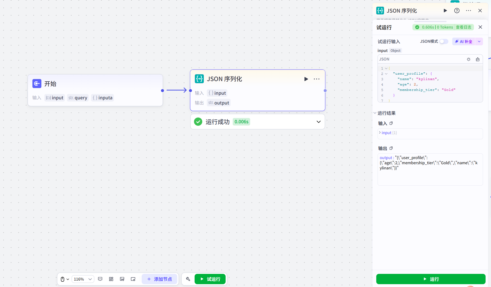

# JSON序列化

## 节点概述
核心功能：将复杂的数据结构（如对象、数组）打包成一个标准、通用的字符串格式，使其能够在不同节点、不同系统间顺畅传递。

## 配置指南
##### 1、添加节点
在工作流画布中，点击 **+ 添加节点**，在组件区域搜索并选择 **JSON序列化节点**，即可将其添加到画布中。
##### 2、 配置节点
**输入**

*   **引用上游变量（最常用）：** 点击输入框，在弹出的变量列表中选择上游节点的输出变量。例如，选择一个代码节点输出的 `userProfile` 对象。
*   **直接输入内容：** 你也可以直接输入一个符合JSON格式的文本。但请注意，系统会将其视为一个字符串，而不是一个对象。此功能主要用于测试或处理已经是字符串但需要确保其格式正确的场景。

**输出**

*   **配置项：** `output` (固定参数)
*   **数据类型：** `String`
*   **说明：** 这是节点唯一的输出参数，它包含了输入变量被转换后的JSON格式字符串。下游节点可以直接引用这个 `output` 参数进行后续处理。

