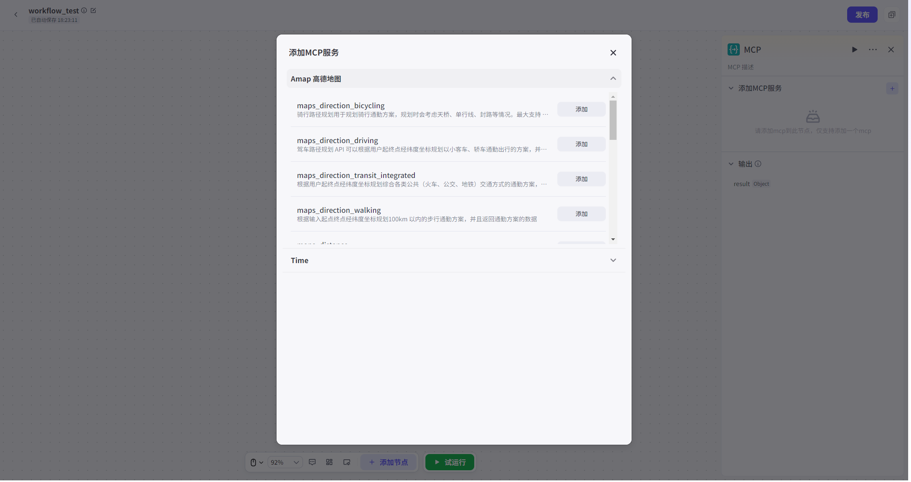
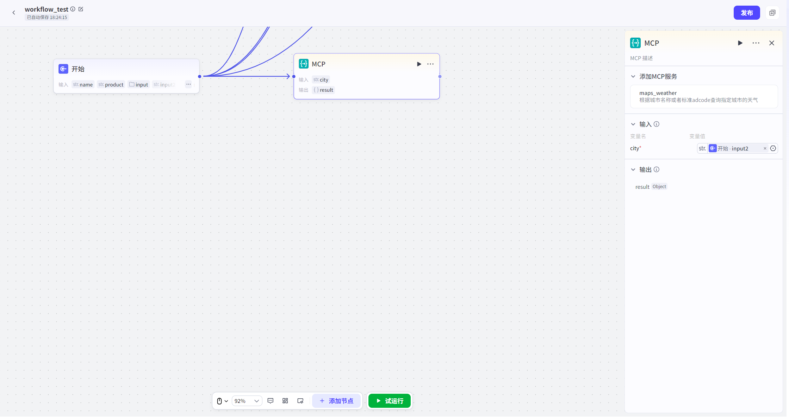

# MCP

调用MCP server的能力。可添加已发布在MCP广场中的MCP server，并关联对应接口生成结果。具体添加MCP的方式详见[MCP导入方式](../3.工具广场.md)

本节点支持用户选择一个已导入的自定义MCP工具中的一个子工具。

输入参数：选择对应的MCP工具后，可编辑本节点的输入字段，输入字段的参数由MCP server决定，不可自行修改。参数类型可选字符串或直接引用开始节点输入参数、其他节点的输出参数。

输出参数：输出参数及参数类型由MCP server决定，不可自行修改。

