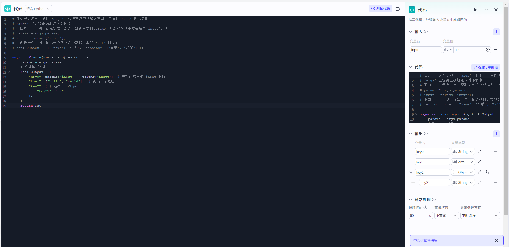

# 代码

## 节点概述
**核心功能**：将自定义编程能力无缝集成到可视化工作流中，突破标准节点的功能限制，实现任意复杂的业务逻辑、数据处理和系统集成。


## 配置指南
配置代码节点主要分为三个核心步骤：**准备输入 -> 编写代码 -> 定义输出**。
##### 1、准备输入参数
输入参数是代码与工作流其他部分沟通的“桥梁”。你需要在这里声明代码中需要用到的所有变量。
* **设置参数名**：为变量起一个有意义的名字（例如 `user_input_text`, `api_key`）。这个名字将用于在代码中引用该变量。
*   **设置变量值**：为参数赋值。你可以选择：
    
    *   **引用变量**：从上游节点的输出中选择，这是最常用的方式，实现了数据的动态传递。
    *   **固定值**：直接输入一个常量，如一个固定的字符串、数字或布尔值等，适用于配置信息。
*   **在代码中如何引用**：
    在代码编辑器中，所有输入参数都被封装在一个名为 `params` 的对象中。通过 `params['你的参数名']` 即可获取其值。
    
    > **示例**：如果你添加了一个参数名为 `user_query`，那么在Python代码中，你可以通过 `query_text = params['user_query']` 来获取它的值。


##### 2、编写核心代码

1.  在“**代码**”编辑区，选择你熟悉的编程语言（目前支持 **Python**）。
3.  **手动编写/修改**：直接从头编写你的代码逻辑。
4.  **试运行：**
    - 在代码节点的配置界面，找到并点击“**测试代码**”或“**测试该节点**”按钮。
    - 界面会弹出一个测试面板，其中会列出你在“**输入**”配置中定义的所有参数。
    - 为每个参数**填写一个模拟值**。这个值应该能代表你在真实工作流中可能遇到的数据情况（例如，测试一个文本处理函数，就输入一段典型的用户文本）
    - **输出参数：**
      - **代码输出：**这是你的代码 `return` 语句返回的、**未经任何修饰的、最原始的JSON对象**。它反映了代码内部定义的所有键值对。
      - **节点输出**：按照代码节点中指定的**输出**参数结构生成的输出结果。

* **核心规则与限制**：

  *   **函数限制**：代码编辑区**不支持定义多个函数**。请将所有逻辑写在主执行体中。
  *   **输出格式**：**必须以对象（Object）的形式返回结果**。即使你只想返回一个简单的字符串或数字，也必须将其包装在一个对象中，并以 `return` 一个对象来输出处理结果。这是确保与下游节点稳定通信的关键。
  > **示例 (Python)**：
  >
  > ```python
  > # 错误的返回方式
  > # return "Hello, world!"
  > 
  > # 正确的返回方式
  > async def main(args: Args) -> Output:
  >     params = args.params
  >     # 构建输出对象
  >     ret: Output = {
  >         "key0": params['input'] + params['input'], # 拼接两次入参 input 的值
  >         "key1": ["hello", "world"],  # 输出一个数组
  >         "key2": { # 输出一个Object 
  >             "key21": "hi"
  >         },
  >     }
  >     return ret
  > ```


##### 3、定义输出结构

输出结构定义了代码执行成功后，会向下游节点传递哪些数据，明确了代码节点的产出。
1.  在“**输出**”配置区，系统会根据你代码中 `return` 的对象**自动解析并预填充**参数名和类型（可在试运行节点时，点击“同步输出”）。
2.  **核对与精简**：请务必仔细检查，确保此处定义的**参数名、数据类型**与代码 `return` 对象中的键值对**完全一致**。
3.  你可以根据下游节点的需求，删除不必要的输出参数，保持接口的简洁。

*   **异常处理输出**：
    当你在节点属性中开启了“异常处理”功能，代码节点还会在运行失败时，额外返回两个标准参数：
    *   `isSuccess` (Boolean): 标识执行是否成功，失败时为 `false`。
    *   `errorBody` (String): 包含详细的错误信息，帮助你调试问题。



## 典型应用场景

*   **复杂数据处理**：对用户上传的CSV文件进行解析、统计、并生成可视化图表数据。
*   **自定义算法**：实现一个特殊的推荐算法，根据用户历史行为和实时输入，动态生成推荐内容。
*   **外部系统集成**：调用天气API获取实时天气，并根据天气情况（晴天、雨天）生成不同的回复策略。
*   **AI模型调用**：使用开源的Hugging Face模型，对用户输入的文本进行情感分析，并将分析结果（积极、消极、中性）作为后续流程的判断依据。
