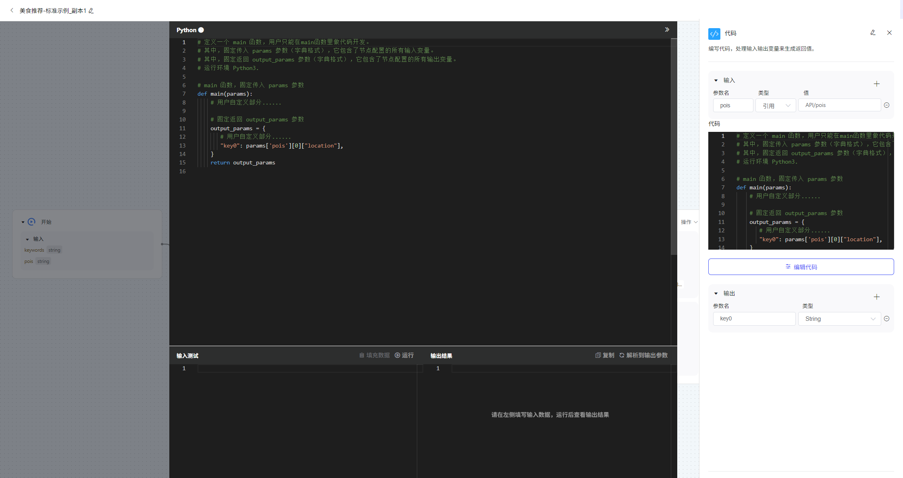

# **代码**

在代码节点中，可通过编写代码实现自定义的处理功能。引入代码节点到画布中，可在编辑器（IDE）内看到默认的示例代码。

编辑器的使用：

引用输入：配置了输入参数名和参数值后，可以在编辑器中引用输入参数。编辑器引入输入参数时，需要通过字典变量 params 引入代码节点的输入参数。代码节点支持不设置输入参数，但是设置的输出参数需要配置对应的默认值或参数引用关系。

返回输出：需要在编辑器中定义一个字典变量，作为编辑器中函数的输出。代码节点的输出参数是该字典变量的键（key）。

运行时环境：编辑器支持的运行时环境为 Python 3 。 运行环境预制了NumPy、bs4包。当前运行环境暂不支持进行request请求或获取文件。

编辑器测试功能：

输入测试：在输入测试区域可以输入测试数据，并进行调试运行。“填充数据” 功能可以根据当前输入参数类型，生成输入数据。