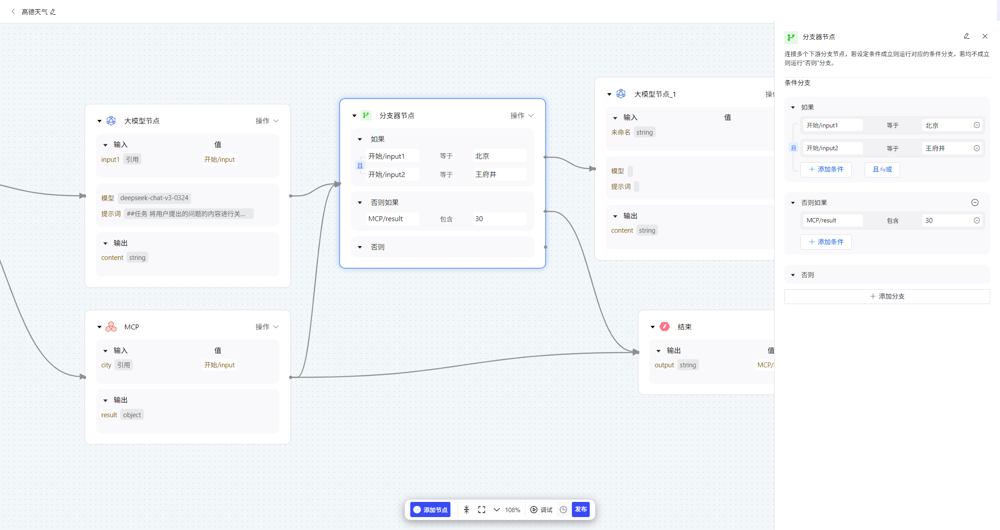

# **分支器**

分支器节点用于设计工作流内的分支流程，可以连接多个下游节点。当向该节点输入参数时，节点会从上到下依次判断是否符合条件，若设定条件成立则运行对应的条件分支，若均不成立则运行“否则”分支。可通过拖拽分支条件配置面板来设定分支条件的优先级。在每个分支条件中，支持选择判断关系（且/或），以及同时添加多个条件。

**IF 条件：**选择变量，设置条件和满足条件的值；
IF 条件判断为 True ，执行 IF 路径；
IF 条件判断为 False ，执行 ELSE 路径；
ELIF 条件判断为 True ，执行 ELIF 路径；
ELIF 条件判断为 False ，继续判断下一个 ELIF 路径或执行最后的 ELSE 路径；

**支持设置以下条件类型：**
包含（Contains）
不包含（Not contains）
开始是（Start with）
结束是（End with）
是（Is）
不是（Is not）
为空（Is empty）
不为空（Is not empty）

