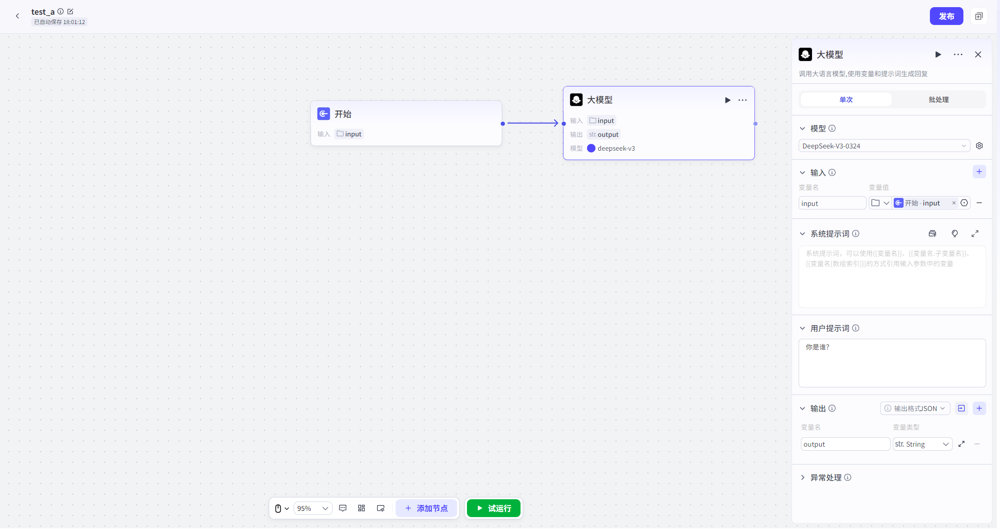

# 大模型

## 节点概述
核心功能：在工作流中注入“大脑”，赋予其理解、推理、生成和决策的能力。

## 配置指南
配置大模型节点，本质上是**选择一位合适的专家，并为他下达清晰、完整的指令**。
##### 1、选择模型
* **如何操作**：在节点配置区的“模型”下拉菜单中，选择一个大型语言模型。模型导入方式详见[模型导入方式-详细版](../模型导入方式-详细版.md)

* 支持用户选择所有已导入平台的大模型并进行参数配置。

*   **建议**：
    
    *   **按需选择**：没有“最好”的模型，只有“最合适”的模型。对于简单的文本润色，基础模型即可胜任；对于复杂的逻辑推理或代码生成，则需要选择更高级的模型。
    
    
##### 2、配置提示词
*   **系统提示词**
    *   **作用**：定义模型的**核心人设、角色和基本原则**。它为模型设定了一个宏观的框架，影响其所有后续的思考和回答。
    *   **如何编写**：
        *   **明确角色**：直接告诉模型“你是一个XX”。例如：“你是一位专业的科技博主。”
        *   **定义任务**：清晰地说明它的核心职责。例如：“你的任务是将复杂的技术概念，用通俗易懂的语言解释给普通读者。”
        *   **设定风格**：规定回复的语言风格。例如：“你的语言风格应该风趣幽默，可以适当使用网络流行语。”
        *   **规定限制**：明确不能做什么。例如：“不要使用任何专业术语，不要生成超过200字的回复。”
*   **用户提示词**
    *   **作用**：承载**本次具体任务**的指令和内容。
    *   **如何配置**：
        *   通常，它不会是固定的文本，而是需要**引用上游节点的输出参数**（例如，引用“输入节点”的 `INPUT`）。
        *   这样，每次工作流运行时，大模型节点接收到的用户提示词都是动态的、实时的。

##### 3、输出

- 将大模型的生成结果结构化为参数。这些参数可直接被下游节点引用，实现工作流的数据流转与自动化。
- **输出格式**：
  - **文本/Markdown**：适用于直接将模型回复展示给用户的场景。输出为一个简单的文本字符
  - **JSON**：**强烈推荐用于复杂工作流**。通过定义结构化的JSON（如`{"new_query": "改写后的查询", "reason": "改写原因"}`），可以让下游节点精确地获取和使用模型输出的不同部分，实现更精细的流程控制。为每个字段设置清晰的“名称”和“描述”能极大提升模型输出JSON的准确性。

##### 4、异常处理

- **超时时间**：设置一个合理的等待上限，避免工作流无限期卡死。
- **重试次数**：对于偶发性网络错误，可以设置自动重试。
- **异常处理方式**：配置一个“备用方案”。当节点异常时，可选择终端流程、返回设定内容、执行异常流程。
- **⚠️ 流式输出的特殊性**：一旦开启流式输出，模型开始“说”出第一个字，即使后续发生异常，也无法再进行重试或跳转异常分支。因为数据流已经开始了。

****
