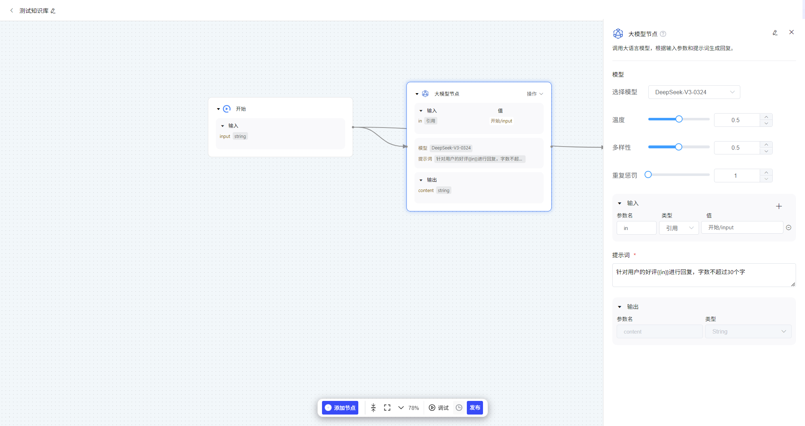

# 大模型

调用大语言模型，根据输入参数和提示词生成回复。

**模型：**支持用户选择所有已导入平台的大模型并进行参数配置。模型导入方式详见[模型导入方式-详细版](../模型导入方式-详细版.md)

- 温度：较高的数值会使输出更加随机，而较低的数值会使其更加集中和确定，建议该参数和多样性只设置1个
- 多样性：影响输出文本的多样性，取值越大，生成文本的多样性越强，建议该参数和温度只设置1个
- 重复惩罚：用通过对已生成的token增加惩罚，减少重复生成的现象，值越大表示惩罚越大

**输入：**此处定义的参数可作为变量，被引用至提示词中。支持直接引用上游节点的输出，实现动态数据传递。

**提示词：**这是驱动大模型的核心指令。您可以通过 {{参数名}} 的语法引用变量。

​	**引用输入变量：**将上游数据动态注入提示词，例如 请总结以下内容：{{input}}。

​	**定义输出结构：**通过预定义输出参数并在提示词中引用，如 请以JSON格式返回结果，其中name字段对应{{output1}}，可以精确控制大模型的输出格式，便于后续节点解析。

**输出：**将大模型的生成结果结构化为参数。这些参数可直接被下游节点引用，实现工作流的数据流转与自动化。

