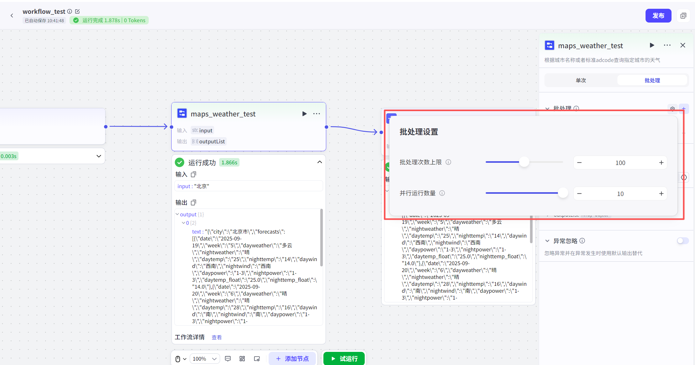
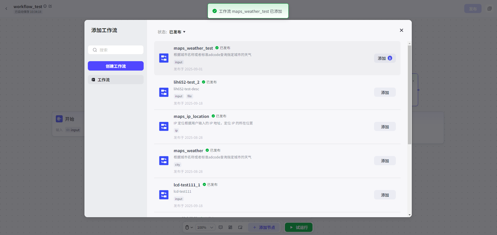
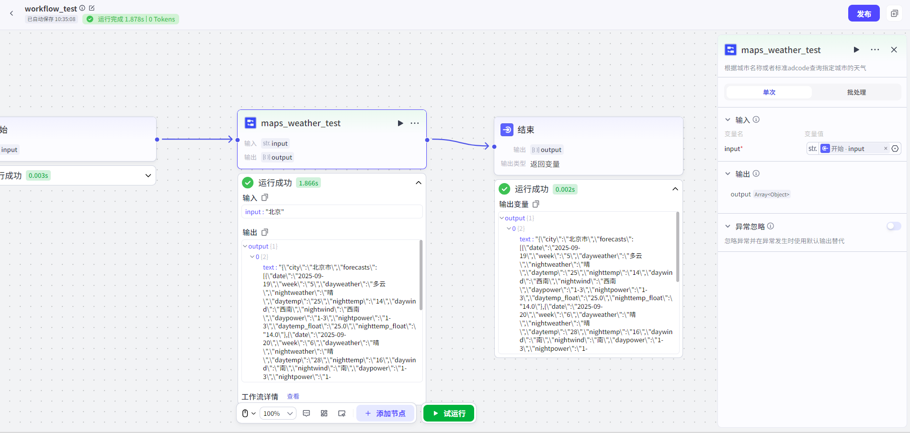

# 工作流

## 节点概述

**核心功能**：它允许你在一个工作流（主流程）中，嵌入另一个工作流（子流程），实现“工作流调用工作流”的强大功能。

## 配置指南

#### 1. 输入与输出：数据的传递
*   **结构固定**：工作流节点的输入和输出结构，完全由它所调用的**子工作流**决定，你无法在父工作流中自定义修改。
*   **配置输入**：你需要为子工作流定义的**必填输入参数**，在父工作流节点中指定数据来源。数据来源支持两种方式：
    *   **固定值**：直接输入一个静态的值，如 `Hello World` 或 `2024`。
    *   **引用变量**：引用上游其他节点的输出结果，实现数据的动态传递。

#### 2. 批处理模式：从“单件处理”到“批量生产”

默认情况下，工作流节点只执行一次。但开启**批处理模式**后，它就能像一条流水线一样，根据你提供的输入列表，反复运行子工作流，直到达到次数限制或者列表的最大长度。
**它能做什么？**
批处理模式能极大提升处理海量数据的效率，特别适合需要重复执行相同任务的场景。
**经典场景**：
假设你的子工作流功能是“图文问答”。

* **单次模式**：输入一张图片，进行图文理解。

* **批处理模式**：输入一个包含 50张不同图片的列表，工作流节点会自动运行 50 次，批量进行50次图文理解。
  **批处理的高级设置**：

  *   **运行次数上限**：控制批处理的最大运行次数，防止意外消耗过多资源（默认为 100 次）。
  *   **并行运行数量**：设置同时可以运行多少个任务。
      *   设为 `1`：表示任务一个接一个地**串行**执行，速度较慢但资源占用少。
      *   设为大于 `1`：表示多个任务可以**并行**执行，速度更快但资源占用多。

  
#### 3. 异常处理：让流程更健壮
工作流节点内置了**忽略异常**功能，这是一个强大的“容错”机制。
*   **功能说明**：开启后，如果该工作流节点在运行时失败（例如，子工作流内部出错），整个父工作流**不会因此中断**，而是会跳过这个错误，继续执行后续的节点。
*   **如何处理输出**：如果下游节点需要引用这个失败节点的输出，系统会使用你为该节点**预先配置的默认输出内容**，从而避免因数据缺失而导致整个流程崩溃。

