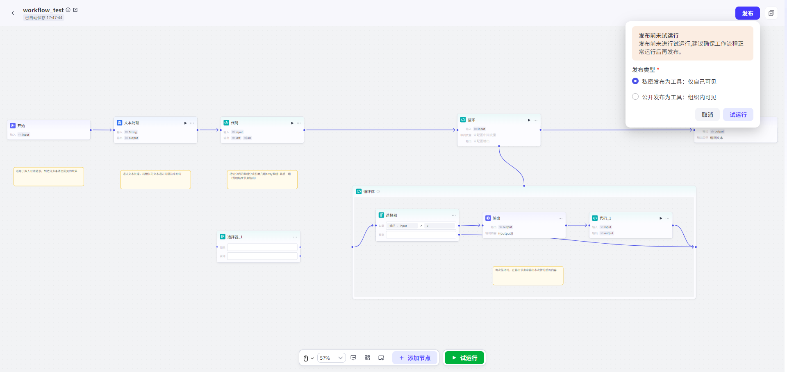
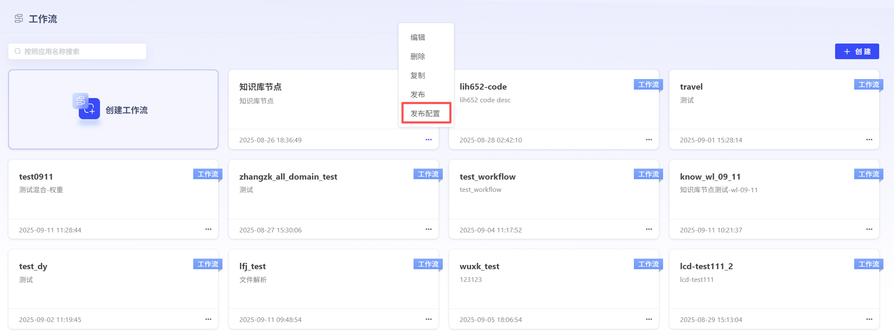
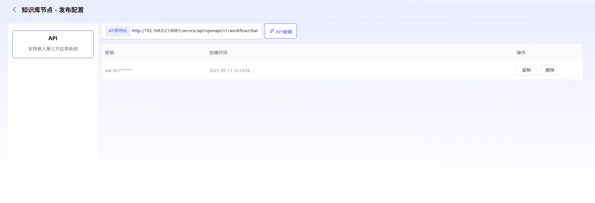

# 工作流

### 1、工作流创建

点击“创建工作流”即可进入工作流创建界面。用户可自行设定工作流名称、工作流描述描述。平台内置了标准工作流示例，用户也可直接复制使用。

### 2、工作流编辑

平台提供MCP、意图识别、API、代码、大模型、分支器、知识库、文档生成、文档解析节点。

### 3、工作流调试与发布

编辑完毕的工作流，点击“调试”，运行成功后，即可进行发布。点击“发布”可进行发布方式选择，用户可进行私密发布，也可进行公开发布。发布完成的工作流可作为工具，被智能体调用。

**私密发布：**发布后仅对自己可见。

**公开发布：**发布后可对全部用户进行共享。

已发布的工作流也可取消发布后，重新进行编辑。并可进行发布配置，创建OpenAPI。

