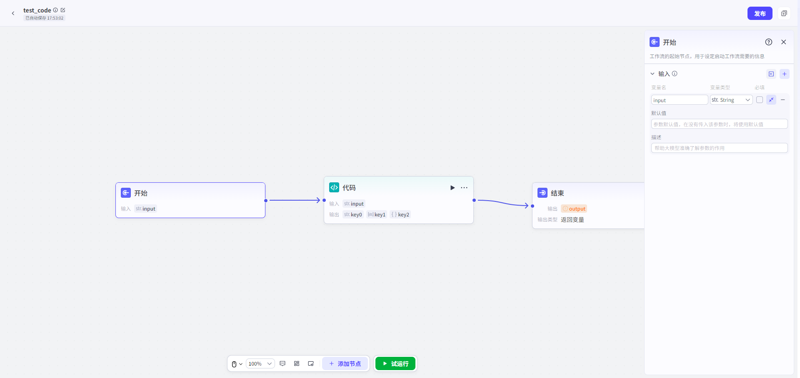

# 开始

## 节点概述

负责定义启动工作流所需的全部条件，是数据流入的源头。

## 配置指南

**1. 添加参数**

*   **手动添加**：设置**变量名**、**变量类型**。
*   **批量导入（高效）**：如果你已经有一个清晰的参数结构，可以点击“**导入JSON**”图标。在弹出的面板中粘贴你的JSON数据结构，系统会自动解析并为你创建所有参数，极大提升配置效率。

**2. 设置数据类型**

*   支持多种基础类型，包括字符串（String）、数字 (Integer, Number)、布尔值（Boolean）、时间（Time）、对象（Object）、数组（Array）、文件（File）。
*   强大的 `Object` (对象) 类型支持最多 **3层嵌套**，可以满足复杂数据结构（如地址信息、产品详情）的定义需求。

**3. 撰写参数描述**

*   一个高质量的描述能让模型更准确地理解参数的用途和期望格式。
*   **示例**：
    *   **差描述**：`city`
    *   **优描述**：`用户希望查询天气的目标城市，例如：北京、上海、纽约。`

**4. 设置是否必填**

*   **必填**：勾选后，如果用户输入中未能提供该参数的信息，工作流将不会被触发。这适用于核心业务逻辑不可或缺的参数（如查询天气时的“城市”）。
*   **可选**：如果参数未提供，工作流仍会启动，该参数值为空。这适用于增强性或补充性的信息。

