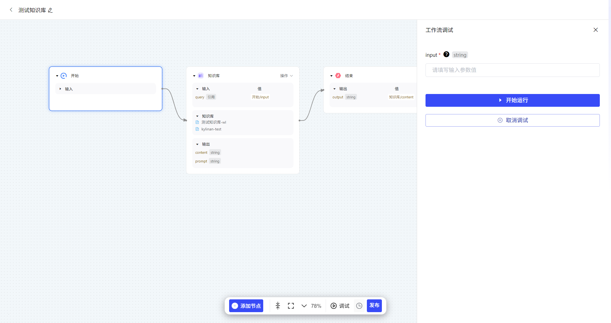
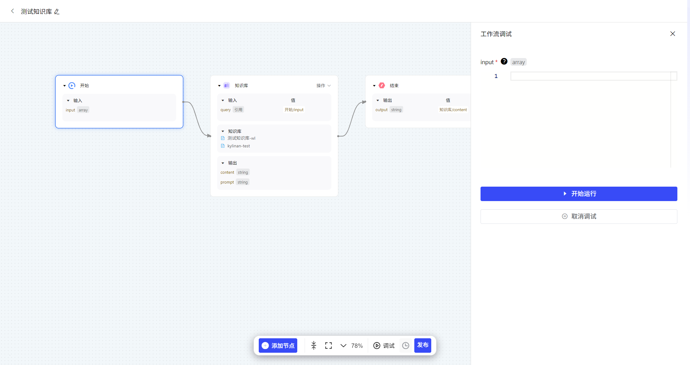
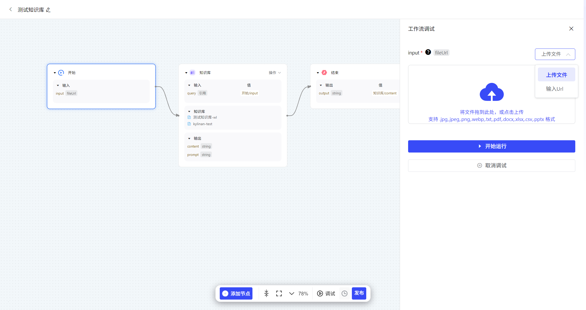

# 开始

“开始” 节点不可以被复制或删除。定义所需的输入参数，会在节点被应用调用时，由思考模型根据参数描述从用户输入的原始内容中抽取并传入。开始节点支持输入以下变量类型，所有变量均为必填项：

- **字符串**：允许用户输入长短字符，作为起始内容。
- **数组**：允许用户输入数组，作为起始内容。
- **单文件**：允许用户单独上传文件，支持 .jpg, .jpeg, .png, .webp, .txt, .pdf, .docx, .xlsx, .csv, .pptx 类型文件格式。支持通过URL上传文件。

