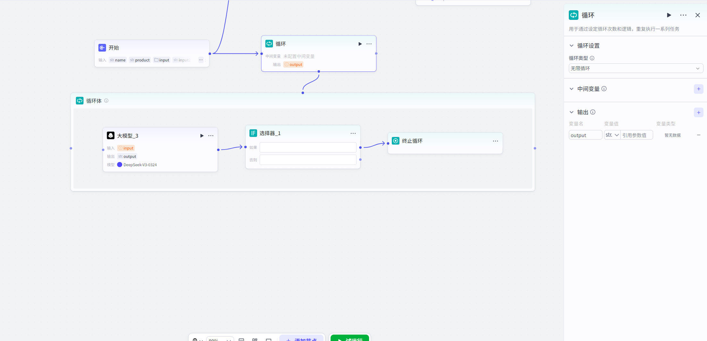

# 循环

## 节点概述
核心功能：在工作流中创建一个自动化流水线”，对一组数据或一项任务进行**重复、批量**的处理，直到完成所有项目或满足特定条件。

## 配置指南

#### 循环配置

##### 1、循环设置

循环节点提供了三种模式，以适应不同的业务需求。配置节点时，首先要选择正确的循环类型。

##### 	1.1、使用数组循环（最常用）

​	这是最常见、最直观的循环模式，类似于编程中的 `for` 循环。它会遍历一个已知的列表（数组），为列表中的**每一个元素**都执行一次循环体内的任务。

- **何时使用**：当你有一个明确的、待处理的数据集合时。例如，一个包含多个用户ID的列表、一个包含多段文章内容的数组。

*   **如何配置**：
    *   **循环数组**：指定一个上游节点输出的**数组类型**变量。循环次数将自动等于该数组的长度。
    *   **概念变量**：
        *   `item`：代表数组中**当前正在处理**的那个元素。例如，数组是 `["张三", "李四"]`，第一次循环时 `item` 是 "张三"，第二次是 "李四"。
        *   `index`：代表当前是**第几次**循环，从 `0` 开始计数。可以用来给结果编号或进行计数。
> **示例**：在长文总结场景中，将文章的各个段落组成一个数组 `["段落1内容", "段落2内容", ...]`。在循环体内，大模型节点的提示词可以这样写：请总结以下这段文字：`{item}`。这样，循环就会依次总结每一个段落。

##### 	1.2、指定循环次数

​	这是一种更简单的循环模式，当你只需要重复执行某个任务**固定次数**时使用。

- **何时使用**：任务本身不依赖于外部数据，只是需要简单重复。例如，重试一个操作3次，或者生成10条随机的创意想法。

*   **如何配置**：
    *   **循环次数**：直接输入一个1到1000之间的数字，或引用上游节点输出的**数值类型**变量。

##### 	1.3、无限循环

​	这是一种高级模式，循环会一直执行，直到你主动告诉它停止”。它类似于编程中的 `while` 循环。

- **何时使用**：无法预先确定循环次数，需要根据**每次循环的执行结果**来动态决定是否继续。例如，轮询某个API直到获取到数据，或实现一个需要用户交互才能退出的游戏。

*   **如何配置**：
    *   **核心是终止条件**：无限循环**必须**与**终止循环节点**配合使用。
    *   **工作流程**：
        1.  在循环体内执行你的核心逻辑（如调用API、询问用户）。
        2.  使用**选择器节点**来判断是否满足终止条件（例如，API返回了数据、用户输入了退出指令）。
        3.  如果满足条件，则工作流流向**终止循环节点**，循环立即结束。
        4.  如果不满足条件，则工作流流向循环体的出口，自动开始下一次循环。

> **示例**：批量处理数据时，调用一个API。如果API返回成功，则继续处理下一个；如果API返回错误码（`error_code`不为空），则通过条件判断节点将流程引向**终止循环节点**，停止整个循环，避免持续报错。
---

##### 2、中间变量：在循环间传递信息

这是一个非常强大的功能，它让你可以在**不同轮次的循环之间共享和累积数据**。

*   **如何配置**：
    1.  在循环节点的设置中，定义一个**中间变量**（如 `last_paragraph`），并为其设置一个初始值（如空字符串 `""`）。
    2.  在循环体的末尾，添加一个**设置变量节点**。
    3.  在该节点中，将循环体的输出结果（如大模型生成的新段落）赋值给这个中间变量。
    4.  在下一次循环开始时，这个中间变量就会携带上一次循环的值，供你使用。

> **示例（长文生成）**：
>
> 1. **循环节点**：设置中间变量 `last_paragraph`，初始值为 `""`。
> 2. **循环体内的大模型节点**：提示词设计为：这是上一段的内容：`{last_paragraph}`。现在请根据当前主题 `{item}` 生成下一段。
> 3. **循环体内的设置变量节点**：将大模型节点的输出 `output` 赋值给 `last_paragraph`。
>    这样，每一段生成都会参考前一段，文章的连贯性大大增强。

##### 3、输出设置：如何汇总结果

循环结束后，你可以决定将什么数据传递给下游节点。

*   **选项1：循环体的执行结果集合**（默认）。这是最常用的方式。它会将**每一次循环**的最终输出结果，按顺序收集起来，组成一个新的**数组**，作为整个循环节点的输出。例如，循环了5次，每次输出一个字符串，最终循环节点会输出一个包含这5个字符串的数组。
*   **选项2：循环变量的取值**。如果你使用了中间变量，可以选择将循环**结束时**该中间变量的最终值作为输出。这在需要累积计算结果（如求和、拼接）的场景中非常有用。

#### 循环体配置

*   **什么是循环体**：创建循环节点后，会自动生成一个与之关联的循环体画布。这里是编排循环逻辑的地方，所有需要在每次循环中重复执行的节点，都应放置在此画布内。
*   **如何操作**：必须**选中循环体画布**，才能向其中添加或拖入节点。循环体外的节点无法移入，循环体内的节点也无法移出。
*   **特殊节点**：**设置变量节点**、**继续循环节点**、**终止循环节点**是循环体的专属节点，只能在循环体内部使用。

## 典型应用场景

循环节点是构建复杂、强大工作流的关键。以下是一些典型用例，帮助你快速理解其价值：

| 场景类别           | 具体案例          | 实现思路                                                     |
| :----------------- | :---------------- | :----------------------------------------------------------- |
| **内容创作与处理** | **长文生成/总结** | 将文章大纲或分段内容作为数组输入循环体，每次循环处理一个段落（如生成、总结、润色），最后将所有段落拼接成完整文章。可实现流式输出，让用户实时看到进度。 |
|                    | **批量文案改写**  | 将一组待改写的广告语放入数组，循环调用大模型节点，为每一条广告语生成3个不同风格的版本。 |
| **数据处理与分析** | **批量数据查询**  | 将一组用户ID作为数组，循环调用API插件，查询每个用户的详细信息，并将所有结果汇总成一个列表。 |
|                    | **问卷调查评分**  | 将多个产品名称作为数组，循环向用户提问，收集每个产品的满意度评分，并计算出最终的NPS得分。 |
| **交互式应用**     | **增强式搜索**    | （无限循环）先进行一次初步搜索，然后询问用户是否满意。如果用户不满意，结合其反馈进行二次搜索，循环此过程，直到用户找到满意答案。 |
|                    | **回合制游戏**    | （无限循环）在一个游戏循环中，处理玩家行动、计算敌人反应、判断胜负条件。只要游戏未结束，就持续进行下一回合。 |