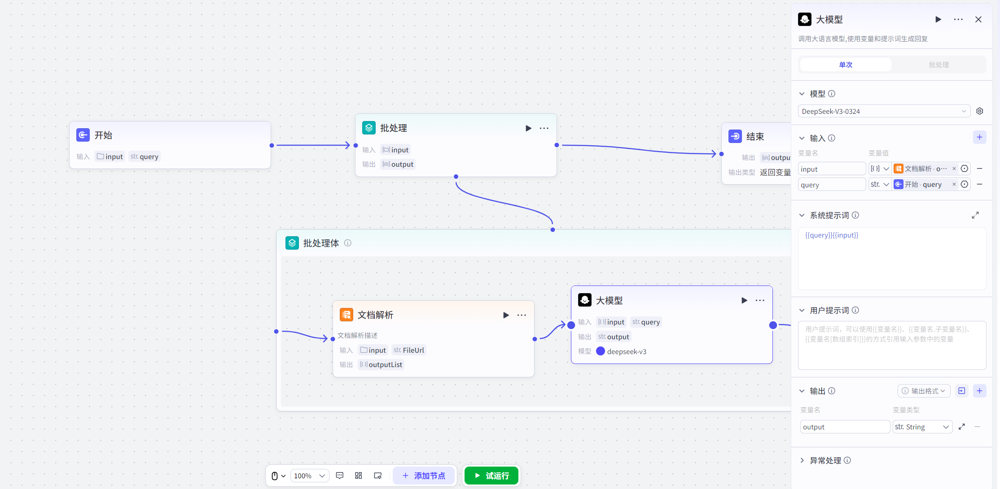

# 批处理

## 节点概述
**核心功能**：将一个任务在给定的数据集上**大规模、高效率地重复执行**，将顺序执行的串行任务，转化为可并行处理的批量任务，极大提升工作流在数据处理场景下的性能。

## 配置指南
配置批处理节点主要分为四个核心步骤：**准备输入 -> 设计批处理体 -> 设置批处理策略 -> 定义输出**。
##### 1、准备输入参数
* **核心规则**：批处理节点**必须且只能**引用上游节点的 `Array` (数组) 类型的输出作为输入。

*   **如何操作**：
    1.  在“**输入**”配置区，添加一个参数。
    2.  在“**变量值**”中，选择引用变量，从上游节点中选择一个数组类型的输出。
    
    
##### 2、设计批处理体
*   **如何操作**：
    1.  在批处理节点上，你会看到一个名为“**批处理体**”的子画布入口。**点击进入**。
    2.  在这个新画布中，通过“拖、拉、拽”的方式，添加你希望为每个数组元素重复执行的节点（例如，HTTP请求、代码节点、大模型节点等）。
    3.  像在主工作流中一样，用连接线将这些节点按逻辑顺序连接起来，形成一个完整的“微型工作流”。
> **重要限制**：
> *   **节点隔离**：不能将批处理体外部的节点拖入批处理体内，反之亦然。这保证了批处理体的逻辑独立性和封装性。
> *   **禁止嵌套**：批处理体内**不能**再添加另一个批处理节点或循环节点，以避免逻辑复杂化和潜在的死循环风险。

##### 3、设置批处理策略

*   **并行运行数量**
    *   控制**每一批**同时运行的任务数量。
    *   **默认值**：`10`。
    *   **如何设置**：
        *   **固定值**：直接输入一个数字（如 `5`）。
        *   **动态引用**：引用上游节点的数值型输出。
    *   **系统限制**：为了系统稳定，你设置的值如果大于10，会被强制设为10；如果小于1，会被强制设为1。
    *   **场景建议**：
        *   **高并发，追求速度**：保持默认值 `10`。
        *   **需要严格串行**：如果任务之间有严格的先后依赖，请将此值设置为 `1`。
*   **批处理次数上限**
    *   控制整个批处理节点**总共**能执行多少次任务。
    *   **默认值**：`100`。
    *   **最大值**：`200`。
    *   **运行逻辑**：当累计执行次数达到此上限时，节点会**立即停止**，即使输入数组中还有未处理的元素。
    *   **示例**：输入数组长度为 `50`，并行数设为 `10`，次数上限设为 `30`。节点会执行3批（每批10个），共30次后停止，数组中剩余的20个元素将被忽略。

##### 4、定义输出参数

批处理完成后，所有子任务的结果需要被收集起来。
* **核心规则**：输出参数**只能引用批处理体内部**节点的输出变量。

*   **如何操作**：
    1.  在“**输出**”配置区，添加一个参数（例如，命名为 `processed_results`）。
    2.  在“**变量值**”中，选择“**引用变量**”，此时变量列表会显示批处理体内部所有节点的输出。
    3.  选择你希望收集的批处理体内部节点的输出。
    
*   **输出格式**：
    最终的输出将**自动是一个数组**。数组的每个元素，就是批处理体中对应那一次执行所产生的结果。数组的顺序与输入数组的元素顺序保持一致。
    
    
## 典型应用场景

*   **场景一：批量内容生成**
    * **需求**：总结多篇文章。
    
    *   **实现**：
        1.  开始节点增加数组变量，输入文章。
        2.  将此数组输入批处理节点。
        3.  在批处理体内，放置一个“文档解析”节点，其输入引用文章。
        4.  放置一个“大模型”节点，用于总结文章内容。
        5.  批处理节点会并发调用以上2个节点，一次性生成所有文章内容总结，并输出一个总结内容数组。
        
        