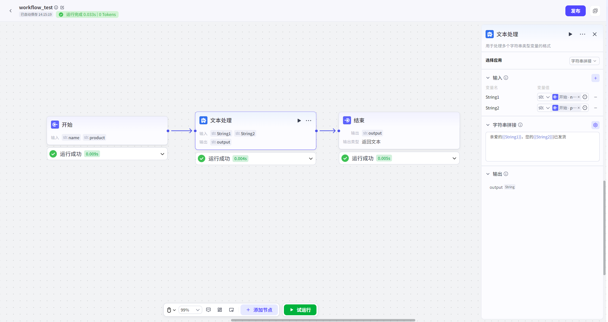
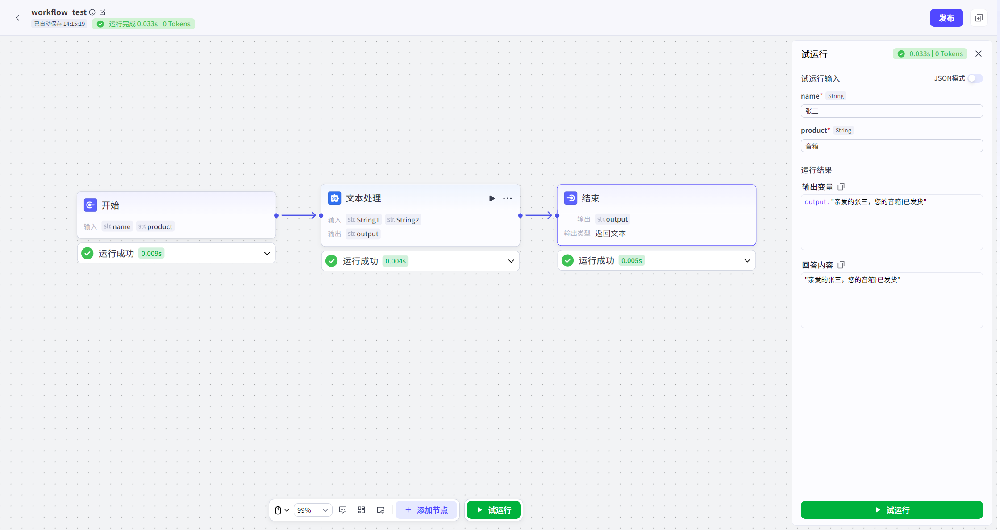
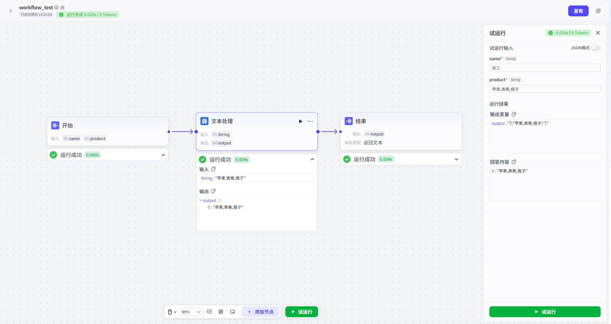

# 文本处理

## 节点概述
**核心功能**：在工作流中扮演“文本工匠”的角色，专门对字符串数据进行高效、灵活的加工、重组和格式化，以满足下游节点的特定输入要求。

## 配置指南
文本处理节点的配置非常直观，核心在于选择“处理方式”并定义相应的规则。
##### 1、选择应用
在节点配置区，首先要从两种核心模式中选择一种：
* **字符串拼接**：将多个输入源合并成一个单一的字符串。

* **字符串分隔**：将一个单一的输入源拆分成一个字符串数组。

  
##### 2、根据模式进行配置
###### **A. 模式一：字符串拼接**
此模式的目标是“**合成**”。
*   **如何操作**：
    1.  在“**输入**”区域，添加所有你希望参与拼接的变量。
    2.  在“**拼接模板**”文本框中，定义最终的输出格式。
*   **核心语法**：
    *   **引用变量**：使用 `{{变量名}}` 的语法，将你在“输入”区域定义的变量插入到模板的任意位置。
    *   **混合固定文本**：你可以在变量前后或之间添加任意的固定文本、标点符号、换行符等。
*   **示例**：
    *   **输入变量**：`user_name` (值为 "张三"), `product_name` (值为 "智能音箱")
    *   **拼接模板**：尊敬的{{user_name}}，您购买的“{{product_name}}”已发货。
    *   **最终输出**：尊敬的张三，您购买的“智能音箱”已发货。

###### **B. 模式二：字符串分隔**
此模式的目标是“**拆解**”。
*   **如何操作**：
    1.  在“**输入**”区域，添加一个待处理的字符串变量。
    2.  在“**分隔符**”配置项中，指定用于切分字符串的“标志”。
*   **核心配置**：
    *   **输入变量**：选择一个上游节点输出的、包含待分隔内容的字符串变量。
    *   **分隔符**：可以是一个或多个字符。平台提供的分隔符包括：
        *   逗号 (,)
        *   换行(\n)
        *   制表符(\t)
        *   句号(。)
        *   分号（；）
        *   空格（ ）
        *   自定义
*   **示例**：
    *   **输入变量**：`tags` (值为 "苹果,香蕉,橙子")
    *   **分隔符**：`,` (一个英文逗号)
    *   **最终输出**：一个字符串数组 `["苹果", "香蕉", "橙子"]`。

##### 3、定义输出
无论选择哪种模式，最终都需要定义节点的输出。
*   **输出**：`output` 
*   **数据类型**：
    *   **拼接模式**：输出为 `String` (字符串)。
    *   **分隔模式**：输出为 `Array` (字符串数组)。
*   **如何使用**：这个输出结果可以被工作流中的任何下游节点引用，例如作为LLM节点的输入、作为循环节点的遍历对象，或作为代码节点的处理数据。

## 典型应用场景

*   **场景一：动态提示词构建**
    *   **需求**：根据多轮对话，提取关键信息（如用户喜欢的绘画风格、画面主体、色彩要求），然后拼接成一个完整的文生图提示词。
    *   **实现**：
        1.  上游节点通过“知识库检索”或“代码节点”提取出 `style` (风格)、`subject` (主体)、`color` (色彩) 三个变量。
        2.  使用文本处理节点的“**拼接**”功能，将它们与固定文本组合：`一幅{{style}}风格的画，主体是{{subject}}，主要色调为{{color}}，高清，细节丰富。`
        3.  输出的完整提示词可直接传递给“文生图”大模型。
*   **场景二：内容二次总结**
    *   **需求**：一个长文档被分成了多个部分，并由LLM节点分别生成了摘要。现在需要将这些子摘要合并成一段总的摘要。
    *   **实现**：
        1.  上游的“批处理节点”或“循环节点”输出了一个包含所有子摘要的数组 `summary_list`。
        2.  使用文本处理节点的“**分隔**”功能（如果结果是一个长字符串）或直接处理数组，将所有摘要用换行符或特定分隔符连接成一个长文本。
        3.  将这个长文本再传递给一个LLM节点，进行最终的“总摘要”生成。
*   **场景三：格式化输出**
    *   **需求**：需要将用户信息（姓名、电话、邮箱）格式化为一个标准的CSV行或JSON字符串。
    *   **实现**：
        1.  获取上游节点输出的 `name`, `phone`, `email` 变量。
        2.  使用文本处理节点的“**拼接**”功能，构建CSV格式：`"{{name}}","{{phone}}","{{email}}"`。
        3.  输出的结果可直接写入文件或传递给其他系统。
