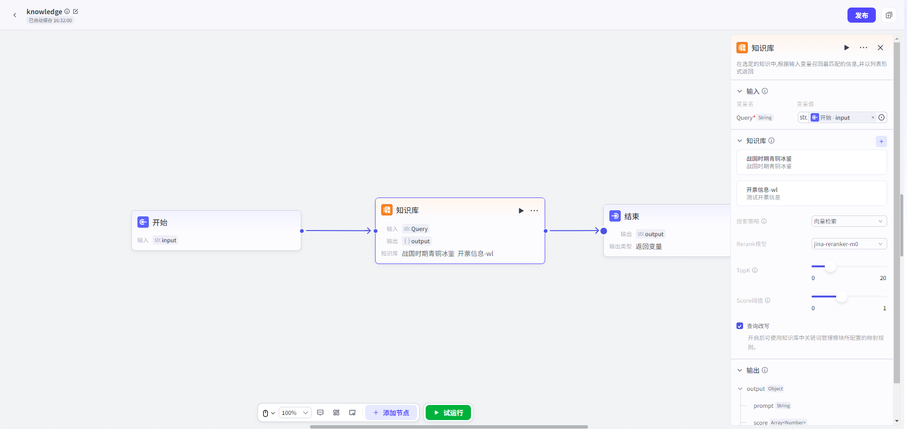

# 知识库

## 节点概述
**核心功能**：赋予智能体精准、高效地访问和利用私有知识的能力。能根据用户的问题，从海量的专属知识库中，快速找到最相关的信息片段，为智能体提供准确、可靠的回答依据。

## 配置指南
配置知识库检索节点，核心是完成三大步：**配置输入 -> 选择知识库 -> 输出**。
##### 1、配置输入
* **配置项**：`Query`

* **数据类型**：`String`

*   **如何配置**：
    
    *   此参数**必须引用上游节点的输出**。最常见的是引用“开始节点”的输入参数（用户原始输入），也可以是经过其他节点处理后的文本。
    
    
##### 2、选择知识库

*   **如何操作**：在“知识库”区域，点击“+”，然后选择一个或多个你已创建的知识库。
*   **召回策略配置**：这是影响检索效果的核心，决定了“图书管理员”用什么方法找书。
    *   **向量检索：**通过向量相似度找到语义相近、表达多样的文本片段，适用于理解和召回语义相关信息。
    *   **全文检索：**基于关键词匹配，能够高效查询包含指定词汇的文本片段，适用于精确查找。
    *   **混合检索-Rerank模型：**重排序模型会根据候选文档与用户问题的语义匹配度，对初步检索结果进行重新排序从而进一步提升最终返回结果的相关性和准确性。
    *   **混合检索-权重设置：**结合向量和关键词检索，融合语义理解与关键词匹配，兼顾相关性和准确性，提升检索效果。
    *   **TopK：**用于控制检索阶段返回的最相关的文档片段的数量。这些文档片段将被送入生成模型中，用于生成最终的回答。
    *   **Score阈值：**检索结果的相似度阈值，低于该值的结果将被过滤。
    *   **查询改写：**开启后可使用知识库中关链词管理模块所配置的映射规则。

##### 3、输出
*   `output` (`Object`): **召回的文本片段内容**。通常会作为上下文传递给后续的LLM节点。

## 典型应用场景

*   **智能客服**：基于公司产品手册、FAQ文档，回答用户关于产品功能、故障排除的咨询。
*   **企业知识助手**：连接公司内部的规章制度、财务流程、人事政策等知识库，为员工提供即时查询服务。
*   **学习辅导机器人**：上传教材、课件、论文，根据学生的问题，精准定位知识点并进行讲解。
*   **个人知识管理**：连接个人的笔记、文档、阅读摘要，打造一个能回答你关于任何个人记录问题的“第二大脑”。