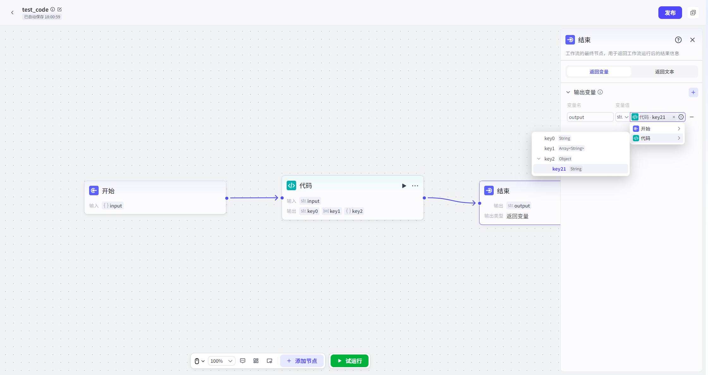

# 结束
## 节点概述
负责将工作流的处理结果，以最恰当的方式呈现给用户或下游系统。

## 配置指南
结束节点是工作流的最后一个节点，它决定了工作流的最终产出物如何被消费。它提供了两种截然不同的返回模式，以适应多样化的应用场景。
##### 模式一：返回变量
此模式下，结束节点会将工作流中处理好的、结构化的数据以 **JSON 格式**输出。
1.  在结束节点选择“**返回变量**”模式。
2.  在“**输出变量**”区域，添加你希望最终输出的变量。
3.  这些变量通常需要**引用上游节点**的输出结果（例如，引用代码节点的计算结果、大模型节点的回答等）。
4.  支持多种基础类型，包括字符串（String）、数字 (Integer, Number)、布尔值（Boolean）、时间（Time）、对象（Object）、数组（Array）、文件（File）。

##### 模式二：返回文本

此模式下，结束节点会直接输出一段预设的**文本内容**，作为智能体对用户的最终回复。
1.  在结束节点选择“**返回文本**”模式。
2.  **配置输出变量**：
    *   此处的“输出变量”主要用于**数据透传**。当你需要将工作流的结果用于**绑定卡片**时，即使你选择了“返回文本”模式，也需要在这里定义好要传递给卡片的变量。
3.  **撰写回答内容**：
    *   这是给用户的最终回复，**不可为空**。
    *   **动态引用**：在回答内容中，你可以通过 `{{变量名}}` 的语法，引用结束节点的输出变量。
    *   **示例**：
        *   假设结束节点的输出变量为 `weather_report`。
        *   你可以在回答内容中写入：`根据查询结果，今日天气如下：{{weather_report}}。祝您生活愉快！`
        *   工作流执行时，`{{weather_report}}` 会被替换为实际的天气报告内容。

## 最佳实践与场景选择

| 场景                                 | 推荐模式                     | 理由                                                         |
| :----------------------------------- | :--------------------------- | :----------------------------------------------------------- |
| **构建纯文本对话机器人**             | **返回文本**                 | 你需要精确控制机器人的每一句回复，确保语气、风格和信息点的准确无误。 |
| **结果需要渲染成自定义卡片**         | **返回变量** 或 **返回文本** | **返回变量**：卡片组件需要JSON数据来动态渲染。 **返回文本**：如果卡片内容固定，仅需透传少量数据，也可使用此模式。 |
| **进行复杂的数据分析或计算**         | **返回变量**                 | 工作流的核心产出是数据（如分析报告、计算结果），JSON格式最便于展示、存档或被其他系统调用。 |
| **需要大模型对结果进行“人性化”包装** | **返回变量**                 | 让大模型做它最擅长的事：将冰冷的数据（JSON）转化为温暖、自然的语言回复。 |
