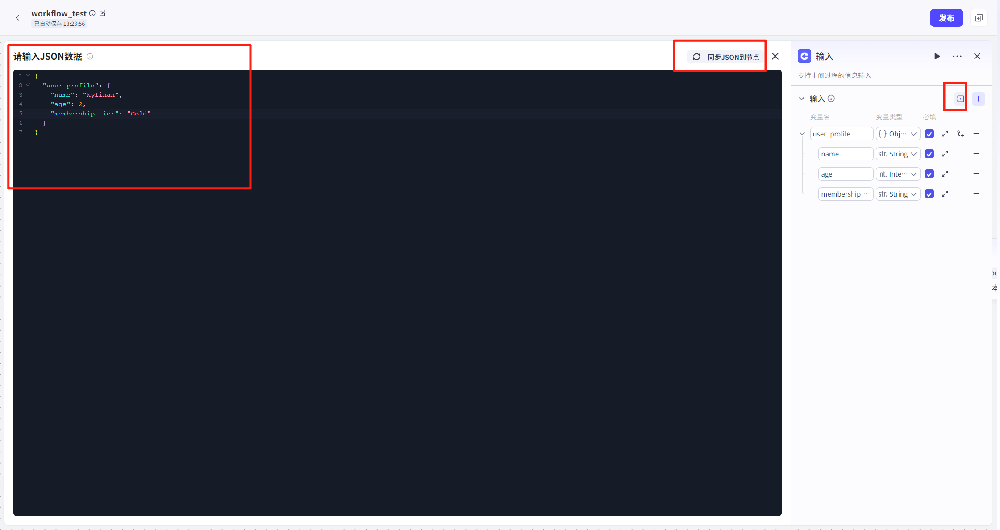

# 输入

## 节点概述
核心功能：在工作流执行过程中，主动暂停并收集来自用户的额外信息，实现与用户的动态、多轮交互。


## 配置指南

输入节点的配置核心在于**定义你想要问用户的问题**。这通过设置“输入参数”来完成。
##### 1 、参数配置
在输入节点的配置面板中，你可以定义一个或多个需要收集的参数。每个参数都包含以下四个关键属性：

- **变量名：**输入参数的名称，用于在后续节点中引用此数据。
- **变量类型**：输入参数的数据类型，如 `String`（字符串）、`Number`（数字）等。
- **描述** ：对参数的清晰说明或提示语，这是用户**直接看到的问题**。
- **是否必选**：设定此参数是否为必须提供的项。


##### 2、批量导入 JSON

当需要收集的参数较多且结构复杂时，手动逐个添加会非常低效。输入节点支持直接导入 JSON 格式的数据结构，一键生成所有参数。
**操作步骤**：

1.  准备一个符合规范的 JSON 对象。
2.  点击配置区域的“JSON导入”。
3.  将 JSON 数据粘贴进去，系统将自动解析并填充所有参数。导入后，系统会自动创建 `name`, `age`, `membership_tier` 三个参数，并填充好对应的类型、描述和必填项。
    **JSON 示例**：
    假设你需要收集用户的“个人档案”信息，可以准备如下 JSON：
4.  **提示：**将 JSON 数据转换为节点上的数据结构，输入请遵循以下规则: 
    - key的名字长度最长 20 字符，超出将自动截断；
    - value值不能为 null，否则将自动忽略；
    - 嵌套层级最多3 层，超出将自动截断
```json
{
  "user_profile": {
    "name": "kylinan",
    "age": 2,
    "membership_tier": "Gold"
  }
}
```
