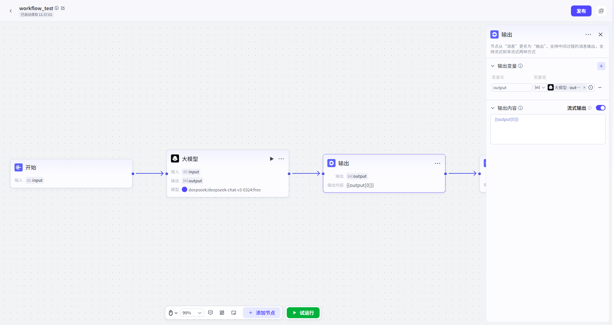

# 输出

## 节点概述
**核心功能**：在工作流执行过程中，主动、即时地向用户发送反馈消息，打破“黑盒等待”，提升对话的交互感和用户体验。

## 配置指南
配置输出节点主要分为两个核心步骤：**准备输出变量 -> 撰写输出内容**。
##### 1、准备输出变量
输出变量让你可以在消息中动态插入工作流中的实时数据，让反馈内容更加个性化和信息丰富。
*   **如何操作**：
    
    1.  在“**输出变量**”配置区，点击“**+**”。
    2.  **设置参数名**：为变量起一个有意义的名字（例如 `current_step`, `estimated_time`）。
    3.  **设置参数值**：为变量赋值。你可以选择：
        *   **引用变量**：从上游节点的输出中选择，这是最常用的方式。例如，引用大模型节点的输出内容。
        *   **固定值**：直接输入一个常量，如一段固定的提示语。
    
    
##### 2、撰写输出内容
这是用户最终看到的反馈消息，是节点的核心产出。
*   **如何操作**：
    1.  **固定值：**在“**输出内容**”文本框中，输入你希望发送给用户的消息。
    2.  **动态引用**：在文本中，使用 `{{变量名}}` 的语法，引用你在上一步中定义的变量。
        *   **示例**：如果你定义了一个变量 `status`，值为“正在生成图表”，那么输出内容可以写为：“当前状态：{{status}}，请稍候。”
*   **高级功能：流式输出**
    *   开启时，回复内容中的大语言模型的生成内容将会逐字流式输出；关闭时，回复内容将全部生成后一次性输出。
        *   **提升实时感**：对于较长的文本，流式输出能营造出一种“正在思考和生成”的生动感，让对话更自然。
        *   **即时反馈**：用户能立刻看到内容开始出现，心理上感觉响应更快，减少了等待焦虑。
    *   **默认行为**：节点默认为**非流式输出**，即等所有内容都准备好后，一次性完整显示。

##### 注意：

1.  **注意执行顺序**：当一个工作流中包含**多个**开启了流式输出的输出节点时，消息会严格按照工作流的**执行顺序**依次发送。请合理规划节点位置，确保反馈的逻辑顺序符合用户预期。
2.  **区分“输出节点”与“结束节点”**：
    *   **输出节点**：用于**过程中的、临时的、非最终**的反馈。一个工作流可以有多个。
    *   **结束节点**：用于**最终的、决定性的**结果输出。一个工作流有且仅有一个（在每条执行路径上）。
    *   **不要用输出节点发送最终结果**，这会破坏工作流的结构，并可能导致下游节点无法正确获取最终数据。

## 典型应用场景

* **长任务处理**

  *   **流程**：用户请求“总结这篇长文档” -> 工作流开始处理（耗时较长）。
  *   **使用输出节点**：在工作流开始处理文档后，立即插入一个输出节点，发送消息：“正在为您阅读和总结文档，请稍候片刻...”。
  *   **效果**：用户收到即时反馈，愿意耐心等待。

  