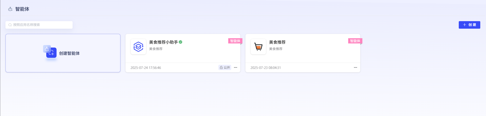
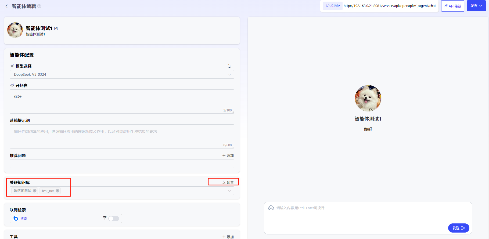
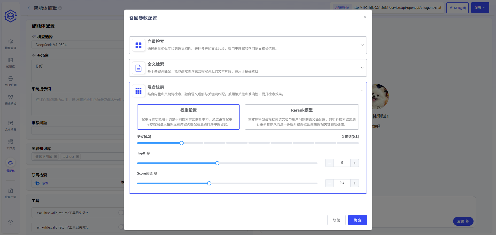
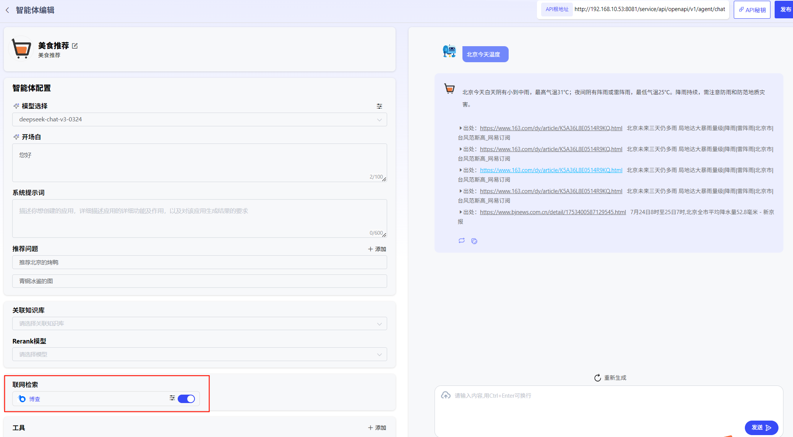
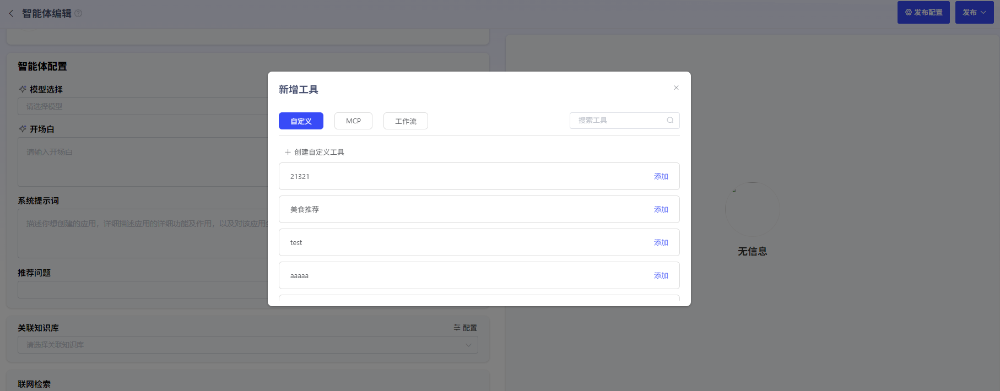
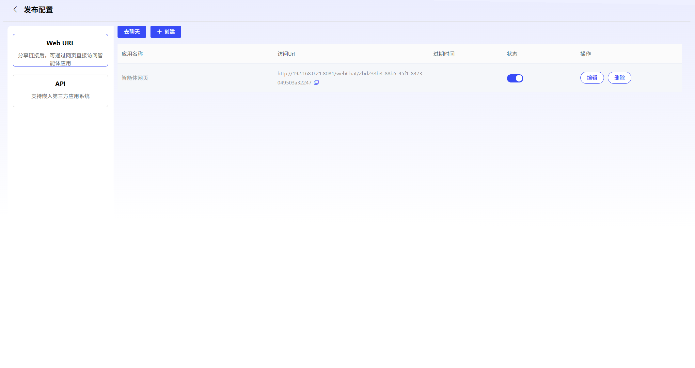
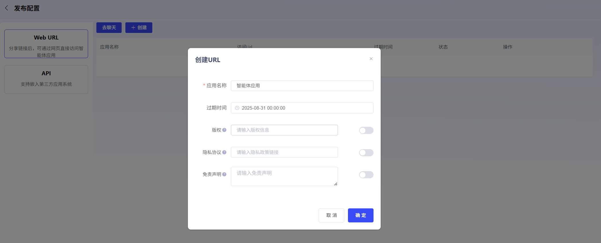
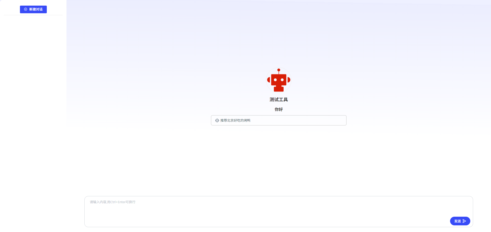
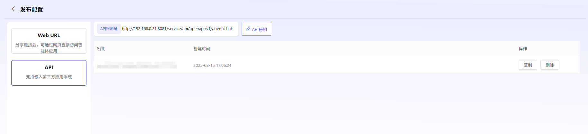

# 智能体

### **1、智能体创建**

点击“创建智能体”即可创建智能体。用户可自行设定智能体图标、智能体名称、智能体描述。

### **2、智能体编辑**

智能体可使用以下几类功能进行应用功能0代码开发：

**选择模型服务：**用户可选择平台中已经纳管的模型，创建智能体。

**开场白：**用于编辑开场问候语

**系统提示词：**填写应用功能描述、应用处理流程描述、以及对生成结果的要求。

**推荐问题：**可设置引导问题

**知识库：**用户通过上传文档为大模型进行知识库外挂。外挂知识库后，可与大模型交互文档中的内容。点击“配置”，即可配置检索方式。知识库需在“工作室”-“知识库”中提前添加。

目前支持3种检索方式配置，用户可根据知识库内文档的内容特点及使用场景，调整检索策略：

1、向量检索：通过向量相似度找到语义相近、表达多样的文本片段，适用于理解和召回语义相关信息。

2、全文检索基于关键词匹配，能够高效查询包含指定词汇的文本片段，适用于精确查找。

3、混合检索：结合向量和关键词检索，融合语义理解与关键词匹配，兼顾相关性和准确性，提升检索效果。

**联网检索：**通过配置联网检索的url和key，可启用“博查”网络搜索辅助问答。

**工具：**用户可添加关联已发布的MCP、工作流、自定义工具。用户通过点击“添加”，选择“MCP”、“自定义”或“工作流”，即可添加已发布的工具。

已发布的智能体也可取消发布后，重新进行编辑。

### **4、发布智能体应用**

点击“发布配置”，可进入配置页面，平台支持2种智能体发布配置：

- **Web URL**

  平台支持将智能体发布为URL，方便外部用户进行访问。

  支持对以下内容进行配置：

  - 应用名称（必填）
  - 过期时间：若不填则默认无过期时间，永久有效
  - 版权
  - 隐私协议
  - 免责声明

  

  

  复制URL至浏览器后，可进行应用问答。

  

- **API**

平台已针对应用封装了API，可点击“API秘钥”生成应用的专属API-Key授权，供用户进行调用。

