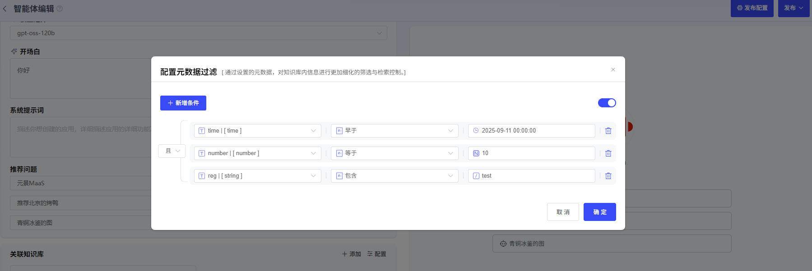

# 智能体

### 1、智能体创建

点击“创建智能体”即可创建智能体。用户可自行设定智能体图标、智能体名称、智能体描述。

### 2、智能体编辑

智能体可使用以下几类功能进行应用功能0代码开发：

**选择模型服务：**用户可选择平台中已经纳管的模型，创建智能体。

**开场白：**用于编辑开场问候语

**系统提示词：**填写应用功能描述、应用处理流程描述、以及对生成结果的要求。

**推荐问题：**可设置引导问题

**联网检索：**通过配置联网检索的url和key，可启用“博查”网络搜索辅助问答。

**工具：**用户可添加关联已发布的MCP、工作流、自定义工具。用户通过点击“添加”，选择“MCP”、“自定义”或“工作流”，即可添加已发布的工具。

**知识库：**用户通过上传文档为大模型进行知识库外挂。外挂知识库后，可与大模型交互文档中的内容。支持用户对知识库进行检索配置和元数据过滤配置：

- **检索配置：**

点击“配置”，即可配置检索方式。知识库需在“工作室”-“知识库”中提前添加。

目前支持3种检索方式配置，用户可根据知识库内文档的内容特点及使用场景，调整检索策略：

1、向量检索：通过向量相似度找到语义相近、表达多样的文本片段，适用于理解和召回语义相关信息。

2、全文检索：基于关键词匹配，能够高效查询包含指定词汇的文本片段，适用于精确查找。

3、混合检索：结合向量和关键词检索，融合语义理解与关键词匹配，兼顾相关性和准确性，提升检索效果。

- **元数据过滤-使用元数据筛选精准定位文档：**

  在智能体中，**元数据筛选**功能，能让你像使用高级搜索一样，根据文档的“标签”（如 `category`、`status`、`author` 等）精确过滤，从而大幅提升检索结果的相关性和准确性。

  **1、选择筛选模式**

  首先，你需要从以下2种模式中选择一种来定义筛选规则。

  - **禁用模式**

    *   **说明**：这是默认选项。选择此模式将完全关闭元数据筛选功能，节点会检索所有选中的知识库，不考虑任何元数据。

    *   **适用场景**：当你需要全面检索，或知识库文档没有统一的元数据标准时。

  - **手动模式**

    *   **说明**：完全由你自定义筛选规则，自由组合多个条件，实现最精细的控制。
    *   **适用场景**：处理复杂的、多条件的、逻辑固定的筛选需求。这是最常用也最强大的模式。

  **2、手动模式配置详解**

  如果你选择了**手动模式**，请按照以下步骤进行配置：

  **第1步：添加筛选条件**

  1）在选择知识库后，点击**设置**按钮，打开元数据过滤按钮。

  2）在配置框内，点击 **+新增条件**。

  3）在弹出的下拉列表中，选择一个元数据字段。

  *   **提示**：该列表会显示你当前选中的**知识库的所有**元数据字段。
  *   如需添加更多字段，重复点击 **+新增条件** 即可。

  **第2步：配置筛选规则**

  选择字段后，你需要根据该字段的**数据类型**（字符串、数字、时间），来设定具体的筛选规则。
  ##### **A. 字符串类型**
  适用于文本字段，如 `标签`、`分类`、`状态` 等。
  | 筛选条件   | 说明与示例                                                   |
  | :--------- | :----------------------------------------------------------- |
  | **是**     | 完全匹配。例如 `is "Published"`，只返回状态**恰好是**“Published”的文档。 |
  | **不是**   | 排除匹配。例如 `is not "Draft"`，返回所有状态**不是**“Draft”的文档。 |
  | **为空**   | 字段为空。返回**未填写**该字段的文档。                       |
  | **不为空** | 字段不为空。返回**已填写**该字段的文档。                     |
  | **包含**   | 包含文本。例如 `contains "Report"`，会返回“Monthly Report”、“Annual Report”等。 |
  | **不包含** | 不包含文本。例如 `not contains "Secret"`，会返回所有不含“Secret”的文档。 |
  | **开始是** | 以...开头。例如 `starts with "Doc"`，会返回“Doc1”、“Document”等。 |
  | **结束是** | 以...结尾。例如 `ends with "2024"`，会返回“Report 2024”、“Summary 2024”等。 |
  > **⚠️ 大小写敏感提醒**：字符串匹配是**大小写敏感**的。`contains "App"` 会匹配 “Apple”，但**不会**匹配 “apple” 或 “APPLE”。
  ##### **B. 数字类型**
  适用于数值字段，如 `阅读量`、`版本号`、`评分` 等。
  | 筛选条件     | 说明与示例                                              |
  | :----------- | :------------------------------------------------------ |
  | **等于**     | 等于。例如 `= 100`，返回标记为100的文档。               |
  | **不等于**   | 不等于。例如 `≠ 5`，返回所有标记不为5的文档。           |
  | **大于**     | 大于。例如 `> 100`，返回标记大于100的文档。             |
  | **小于**     | 小于。例如 `< 50`，返回标记小于50的文档。               |
  | **大于等于** | 大于或等于。例如 `≥ 20`，返回标记大于或等于20的文档。   |
  | **小于等于** | 小于或等于。例如 `≤ 200`，返回标记小于或等于200的文档。 |
  | **为空**     | 字段为空。返回**未设置**该数字字段的文档。              |
  | **不为空**   | 字段不为空。返回**已设置**该数字字段的文档。            |
  ##### **C. 时间类型**
  适用于日期字段，如 `发布日期`、`最后修改时间` 等。
  | 筛选条件   | 说明与示例                                                   |
  | :--------- | :----------------------------------------------------------- |
  | **是**     | 日期完全匹配。例如 `is "2024-01-01"`，只返回该日期的文档。   |
  | **早于**   | 早于指定日期。例如 `before "2024-01-01"`，返回2024年1月1日之前的所有文档。 |
  | **晚于**   | 晚于指定日期。例如 `after "2024-01-01"`，返回2024年1月1日之后的所有文档。 |
  | **为空**   | 字段为空。返回**未设置**该时间字段的文档。                   |
  | **不为空** | 字段不为空。返回**已设置**该时间字段的文档。                 |
  
  **第3步：设置筛选值**
  
  定义好规则后，你需要为规则提供一个具体的**筛选值**。
  
  *   **字符串/数字**：直接输入即可，如 `Published`、`100`。
  *   **时间**：系统会提供一个**时间选择器**，让你直观地选择日期，而无需手动输入格式。

  **第4步：定义条件间的逻辑关系**
  
  当你添加了**多条**筛选条件时，需要设定它们之间的关系。
  *   **且逻辑**
      *   **含义**：文档**必须同时满足**所有条件，才会被检索到。
      *   **示例**：`category is "报告" 且 status is "已发布"`，只会检索出“分类为报告”**并且**“状态为已发布”的文档。
  *   **或逻辑**
      *   **含义**：文档**只需满足其中任意一个**条件，就会被检索到。
      *   **示例**：`author is "张三" 或 author is "李四"`，会检索出所有作者是“张三”**或者**“李四”的文档。

### 3、发布智能体应用

点击“发布配置”，可进入配置页面，平台支持2种智能体发布配置：

- **Web URL**

  平台支持将智能体发布为URL，方便外部用户进行访问。

  支持对以下内容进行配置：

  - 应用名称（必填）
  - 过期时间：若不填则默认无过期时间，永久有效
  - 版权
  - 隐私协议
  - 免责声明

  

  

  复制URL至浏览器后，可进行应用问答。

  

- **API**

平台已针对应用封装了API，可点击“API秘钥”生成应用的专属API-Key授权，供用户进行调用。

已发布的智能体也可取消发布后，重新进行编辑。

