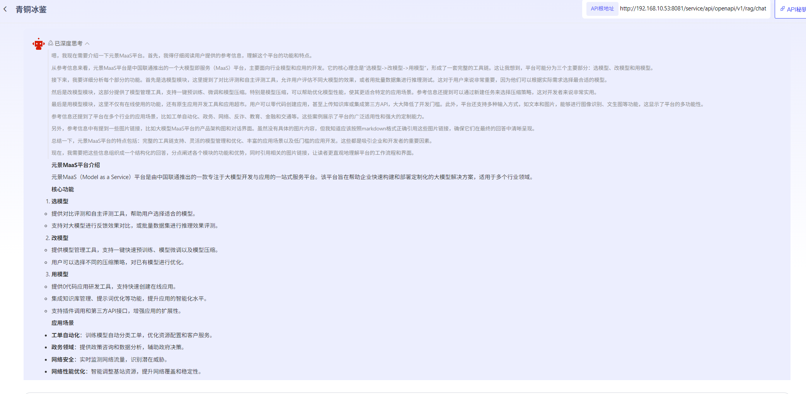
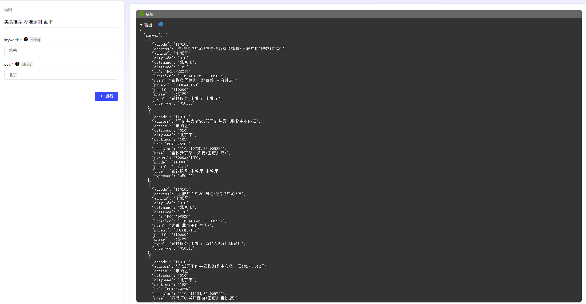

# 应用广场

### **1、应用体验**

支持用户在探索广场上使用已发布的应用。包括其他用户公开发布的应用以及自己私密发布的应用。对于常用应用，可以点击进行收藏，方便下次使用。

**文本问答体验**

用户点击文本问答卡片，可在线使用文本问答，并可根据API接口进行调用。具体调用方式详见接口文档。

**工作流体验**

用户点击工作流卡片，可在线体验工作流。

**智能体体验**

用户点击智能体卡片，可在线使用智能体，并可根据API接口进行调用。具体调用方式详见接口文档。

### **2、历史应用**

可通过历史应用查看历史使用过的全部应用。智能体可查看历史对话内容，可在历史对话窗口下继续交互提问，也可以新建对话再次使用。对于文本问答和工作流应用，不记录历史对话内容，仅支持在线使用。