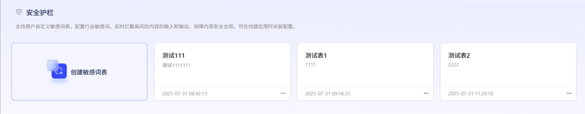

# 安全护栏

根据不同行业需求，用户可维护自己的敏感词表，来控制模型反馈结果的安全性。 

### 1.创建词表

点击“安全护栏”进入敏感词管理

点击“创建敏感词”，进入创建界面

### 2.编辑词表

编辑词表内容，点击敏感词管理列表操作列的“编辑”按钮，进入词表编辑页。点击“添加敏感词”，可单条或批量添加敏感词。

点击“回复设置”，可自定义敏感词命中后的模型回复内容。若不设置,系统将默认回复：您当前请求或者历史信息中包含敏感内容，根据相关安全要求，该轮对话终止，请清除历史信息或者重新开启新的对话。

### 3.使用敏感词

用户可在智能体或文本问答应用中，配置安全护栏，关联已创建好的敏感词表。启用安全护栏工具后，若命中敏感词，将根据配置好的回复进行解答。

