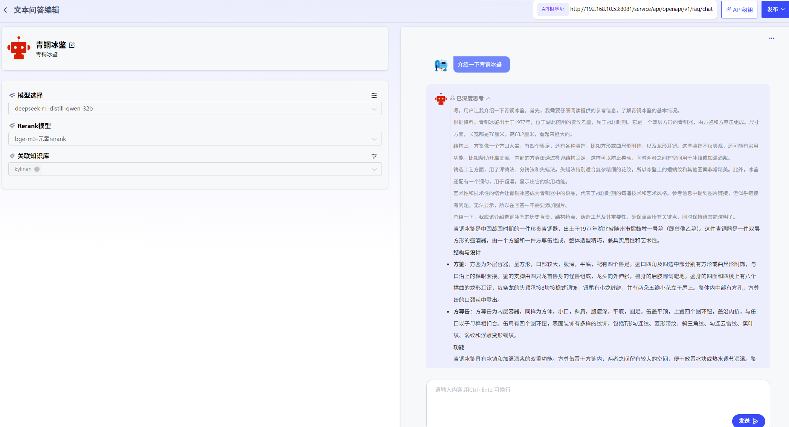
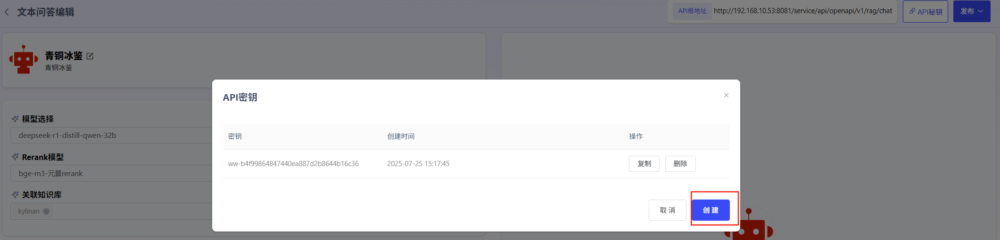

# 文本问答

### **1、文本问答创建**

点击“创建文本问答”即可创建文本问答应用。用户可自行设定文本问答图标、名称、描述。

### **2、文本问答编辑**

可通过选择大模型、rerank模型、知识库，进行文本问答。问答将局限于知识库内，并给出相应出处。

### **3、文本问答发布**

编辑完毕的文本问答应用，点击“发布”可进行发布方式选择，用户可进行私密发布，也可进行公开发布。

私密发布：发布后仅对自己可见，可在“探索广场”-“私密发布的”查看。

公开发布：发布后可对全部用户进行共享，所有用户可在“探索广场”-“全部”查看。

已发布的文本问答也可取消发布后，重新进行编辑。

### **4、生成API**

  平台已针对应用封装了API，可点击“API秘钥”生成应用的专属API-Key授权，供用户进行调用。

