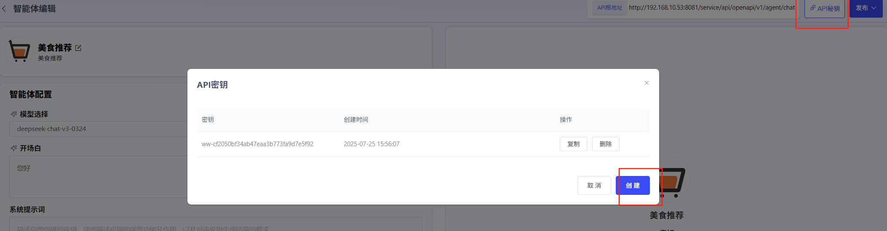

# 智能体

### **1、智能体创建**

点击“创建智能体”即可创建智能体。用户可自行设定智能体图标、智能体名称、智能体描述。

### **2、智能体编辑**

智能体可使用以下几类功能进行应用功能0代码开发：

**选择模型服务：**用户可选择平台中已经纳管的模型，创建智能体。

**开场白：**用于编辑开场问候语

**系统提示词：**填写应用功能描述、应用处理流程描述、以及对生成结果的要求。

**推荐问题：**可设置引导问题

**知识库：**用户通过上传文档为大模型进行知识库外挂。外挂知识库后，可与大模型交互文档中的内容。知识库需在“工作室”-“知识库”中提前添加。

**联网检索：**通过配置联网检索的url和key，可启用“博查”网络搜索辅助问答。

**工具：**用户可添加关联已发布的工作流。用户通过点击“添加”，选择“工作流”，即可添加已发布的工作流。

已发布的智能体也可取消发布后，重新进行编辑。

### **4、生成API**

  平台已针对应用封装了API，可点击“API秘钥”生成应用的专属API-Key授权，供用户进行调用。

